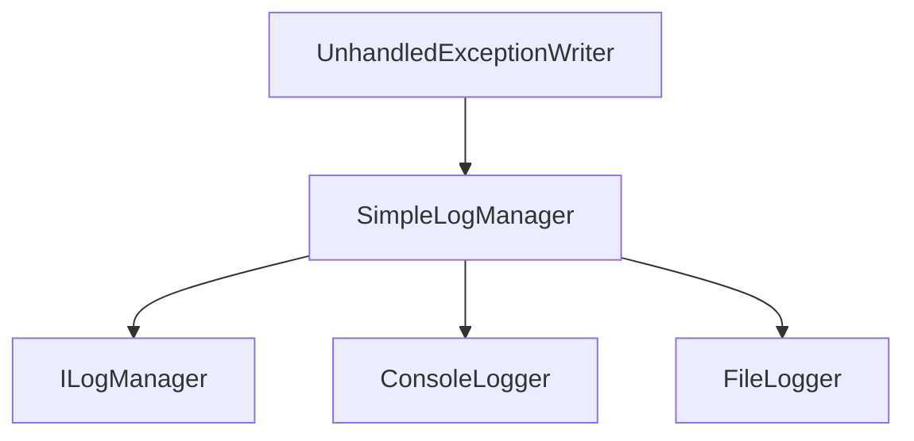

# Component: Emby.Server.Implementations.Logging

**Path:** `Emby.Server.Implementations/Logging/`
**Type:** Directory | Sub-Module
**Language:** C#
**Maps to:** `.discovery/203-emby-server-impl-logging.md`

## Description

Logging infrastructure for the server. Provides logging management, console logging, and unhandled exception handling.

## Directory Structure

```
Emby.Server.Implementations/Logging/
├── ConsoleLogger.cs
├── SimpleLogManager.cs
└── UnhandledExceptionWriter.cs
```

## Files

| File | Description |
|------|-------------|
| `SimpleLogManager.cs` | Main logging manager |
| `ConsoleLogger.cs` | Console output logger |
| `UnhandledExceptionWriter.cs` | Exception logging |

## Decomposition

### SimpleLogManager.cs

#### Classes
`SimpleLogManager` (public class : ILogManager)

#### Key Properties
| Property | Type | Description |
|----------|------|-------------|
| `LogSeverity` | `LogSeverity` | Current log severity |
| `LogFilePath` | `string` | Log file path |

#### Key Methods
| Method | Return | Description |
|--------|--------|-------------|
| `GetLogger(string)` | `ILogger` | Get logger instance |
| `Flush()` | `Task` | Flush all loggers |

### ConsoleLogger.cs

#### Classes
`ConsoleLogger` (public class : ILogger)

#### Key Methods
| Method | Return | Description |
|--------|--------|-------------|
| `Info(string)` | `void` | Log info message |
| `Error(string)` | `void` | Log error message |
| `Debug(string)` | `void` | Log debug message |

## Architecture



## Dependencies

- MediaBrowser.Model.Logging — Logging interfaces
- System — Core types

## Statistics

| Metric | Value |
|--------|-------|
| C# Files | 3 |
| LOC | ~12,000 |
| Public Classes | 3 |
