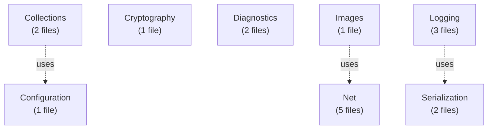

# Emby.Server.Implementations - Smaller Modules

**Module:** Emby.Server.Implementations
**Language:** C#
**Maps to:** `.discovery/203-emby-server-impl-other.md`

## Covered Modules

### Collections (2 files)
```
Collections/
├── CollectionManager.cs            - Manages media collections
└── CollectionImageProvider.cs     - Collection artwork
```

### Configuration (1 file)
```
Configuration/
└── ServerConfigurationManager.cs - Server configuration
```

### Cryptography (1 file)
```
Cryptography/
└── CryptographyProvider.cs        - Crypto utilities
```

### Diagnostics (2 files)
```
Diagnostics/
├── CommonProcess.cs               - Process utilities
└── ProcessFactory.cs             - Process creation
```

### EnvironmentInfo (1 file)
```
EnvironmentInfo/
└── EnvironmentInfo.cs            - Environment details
```

### HttpClientManager (2 files)
```
HttpClientManager/
├── HttpClientManager.cs          - HTTP client management
└── HttpClientInfo.cs             - Client info
```

### Images (1 file)
```
Images/
└── BaseDynamicImageProvider.cs   - Dynamic image generation
```

### Logging (3 files)
```
Logging/
├── SimpleLogManager.cs           - Logging manager
├── ConsoleLogger.cs              - Console output
└── UnhandledExceptionWriter.cs   - Exception logging
```

### MediaEncoder (1 file)
```
MediaEncoder/
└── EncodingManager.cs            - Media encoding
```

### Net (5 files)
```
Net/
├── UdpSocket.cs                  - UDP socket
├── SocketFactory.cs              - Socket creation
├── IWebSocket.cs                 - WebSocket interface
├── WebSocketConnectEventArgs.cs  - Event args
└── DisposableManagedObjectBase.cs - Base class
```

### Networking (5 files)
```
Networking/
├── NetworkManager.cs             - Network utilities
└── IPNetwork/                   - IP network utilities
```

### News (2 files)
```
News/
├── NewsService.cs                - News service
└── NewsEntryPoint.cs            - Entry point
```

### Playlists (3 files)
```
Playlists/
├── PlaylistManager.cs            - Playlist management
├── PlaylistImageProvider.cs     - Artwork
└── ManualPlaylistsFolder.cs    - Manual playlist folder
```

### Properties (1 file)
```
Properties/
└── AssemblyInfo.cs              - Assembly metadata
```

### Reflection (1 file)
```
Reflection/
└── AssemblyInfo.cs             - Reflection utilities
```

### Serialization (2 files)
```
Serialization/
├── JsonSerializer.cs            - JSON serialization
└── XmlSerializer.cs            - XML serialization
```

### Threading (2 files)
```
Threading/
├── CommonTimer.cs               - Timer implementation
└── TimerFactory.cs             - Timer creation
```

### Updates (1 file)
```
Updates/
└── InstallationManager.cs      - Update installation
```

### Xml (1 file)
```
Xml/
└── XmlReaderSettingsFactory.cs - XML reader settings
```

## Architecture



## Statistics

| Module | Files | Purpose |
|--------|-------|---------|
| Collections | 2 | Media collection management |
| Configuration | 1 | Server config |
| Cryptography | 1 | Encryption utilities |
| Diagnostics | 2 | Process diagnostics |
| EnvironmentInfo | 1 | Environment info |
| HttpClientManager | 2 | HTTP client pooling |
| Images | 1 | Dynamic images |
| Logging | 3 | Logging system |
| MediaEncoder | 1 | Encoding management |
| Net | 5 | Networking utilities |
| Networking | 5+ | Network management |
| News | 2 | News feed |
| Playlists | 3 | Playlist management |
| Properties | 1 | Assembly info |
| Reflection | 1 | Reflection utilities |
| Serialization | 2 | JSON/XML serialization |
| Threading | 2 | Thread management |
| Updates | 1 | Update management |
| Xml | 1 | XML utilities |

**Total:** ~35 files across 19 modules
