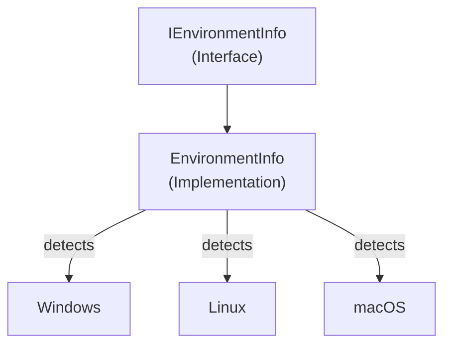

# Emby.Server.Implementations - EnvironmentInfo Module

**Module:** Emby.Server.Implementations/EnvironmentInfo
**Language:** C#
**Maps to:** `.discovery/204-emby-server-impl-environmentinfo.md`

## Decomposition

### EnvironmentInfo.cs (Environment Information Provider)

#### Imports
```csharp
using System;
using System.Runtime.InteropServices;
using MediaBrowser.Common.Implementations;
```

#### Classes
`EnvironmentInfo` (public class : IEnvironmentInfo)

#### Key Properties
```csharp
string OperatingSystemDisplayName { get; }
IApplicationHost ApplicationHost { get; set; }
bool IsWindows { get; }
bool IsLinux { get; }
bool IsMacOS { get; }
```

#### Key Methods
```csharp
void SetEnvironmentVariable(string name, string value)
string GetEnvironmentVariable(string name)
Version GetRunningFrameworkVersion()
```

## Architecture



## File Listing

```
EnvironmentInfo/
└── EnvironmentInfo.cs - Environment and OS information provider
```

## Description

EnvironmentInfo module provides information about the runtime environment. It detects the operating system (Windows, Linux, macOS), provides framework version information, and manages environment variables.

## Dependencies

- **MediaBrowser.Common.Implementations** - Common base classes
- **System.Runtime.InteropServices** - Platform detection

## Statistics

- **Files:** 1
- **Lines:** ~150
- **Classes:** 1
