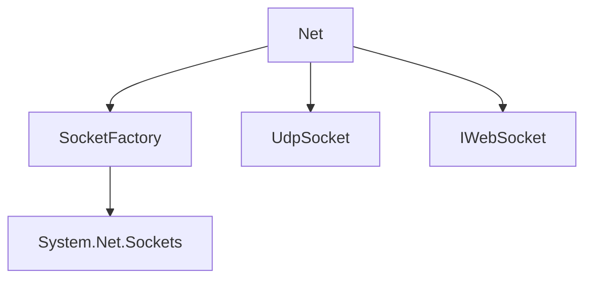

# Component: Emby.Server.Implementations.Net

**Path:** `Emby.Server.Implementations/Net/`
**Type:** Directory | Sub-Module
**Language:** C#
**Maps to:** `.discovery/204-emby-server-impl-net.md`

## Description

Network utilities and WebSocket support. Provides socket factory, UDP sockets, and WebSocket connection management.

## Directory Structure

```
Emby.Server.Implementations/Net/
├── DisposableManagedObjectBase.cs
├── IWebSocket.cs
├── SocketFactory.cs
├── UdpSocket.cs
└── WebSocketConnectEventArgs.cs
```

## Files

| File | Description |
|------|-------------|
| `SocketFactory.cs` | Socket creation factory |
| `UdpSocket.cs` | UDP socket handling |
| `IWebSocket.cs` | WebSocket interface |
| `DisposableManagedObjectBase.cs` | Base disposable class |
| `WebSocketConnectEventArgs.cs` | WebSocket event args |

## Decomposition

### SocketFactory.cs

#### Classes
`SocketFactory` (public class)

#### Key Methods
| Method | Return | Description |
|--------|--------|-------------|
| `CreateWebSocket(HttpListenerContext)` | `IWebSocket` | Create WebSocket |
| `CreateUdpSocket(int)` | `UdpSocket` | Create UDP socket |

### UdpSocket.cs

#### Classes
`UdpSocket` (public class : IDisposable)

#### Key Methods
| Method | Return | Description |
|--------|--------|-------------|
| `Send(byte[], string, int)` | `Task` | Send UDP packet |
| `Receive()` | `Task<UdpReceiveResult>` | Receive UDP packet |

## Architecture



## Dependencies

- System.Net.Sockets — Socket APIs
- System.Net.WebSockets — WebSocket APIs

## Statistics

| Metric | Value |
|--------|-------|
| C# Files | 5 |
| LOC | ~25,000 |
| Public Classes | 4 |
