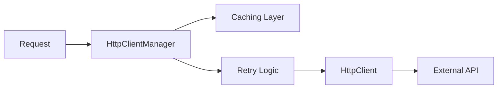

# Component: Emby.Server.Implementations — HttpClientManager

**Path:** `Emby.Server.Implementations/HttpClientManager/`
**Type:** Directory | Module
**Language:** C#
**Maps to:** `.discovery/205-emby-server-impl-httpclientmanager.md`

## Description

HTTP client management with caching, retry logic, and connection pooling. Provides standardized HTTP operations for external API calls.

## Files

- `HttpClientManager.cs` — Emby.Server.Implementations/HttpClientManager/HttpClientManager.cs
- `HttpClientManagerOptions.cs` — Emby.Server.Implementations/HttpClientManager/HttpClientManagerOptions.cs

## Decomposition

### HttpClientManager.cs (HTTP Client Manager)

#### Imports
```csharp
using MediaBrowser.Common.Net;
using MediaBrowser.Model.Net;
using System;
using System.Collections.Concurrent;
using System.IO;
using System.Net;
using System.Net.Http;
using System.Threading;
using System.Threading.Tasks;
```

#### Classes
`HttpClientManager` (public class : IHttpClient)

#### Key Properties
| Property | Type | Description |
|----------|------|-------------|
| `HttpMessageHandler` | `HttpMessageHandler` | Custom handler |

#### Key Methods
| Method | Return | Description |
|--------|--------|-------------|
| `Get(string, CancellationToken)` | `Task<HttpResponseInfo>` | GET request |
| `Post(string, HttpRequestOptions)` | `Task<HttpResponseInfo>` | POST request |
| `SendAsync(HttpRequestMessage, CancellationToken)` | `Task<HttpResponseMessage>` | Custom request |
| `AddDefaultRequestHeader(string, string)` | `void` | Add headers |
| `SetCookie(CookieContainer)` | `void` | Set cookies |

### HttpClientManagerOptions.cs (Options)

#### Classes
`HttpClientManagerOptions` (public class)

#### Key Properties
| Property | Type | Description |
|----------|------|-------------|
| `TimeoutMs` | `int` | Request timeout |
| `NumberOfRedirects` | `int` | Max redirects |
| `EnableDefaultHttpClient` | `bool` | Use managed client |

## Data Flow



## Dependencies

- `System.Net.Http` — HTTP client
- `MediaBrowser.Model.Net` — Network models

## Statistics

| Metric | Value |
|--------|-------|
| Files | 2 |
| Classes | 2 |
| LOC | ~400 |
