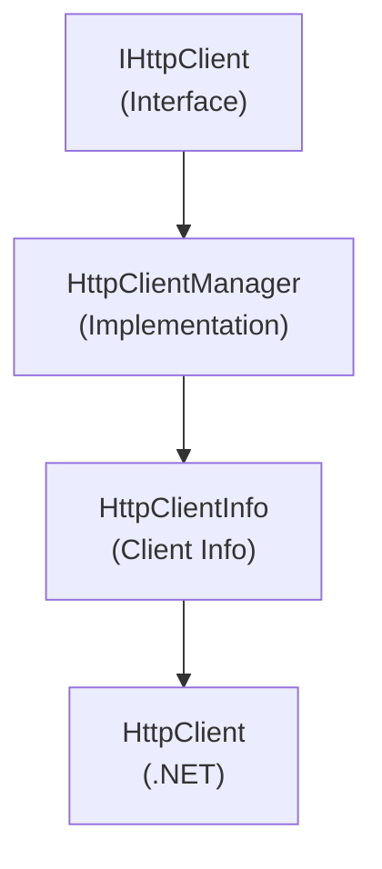

# Emby.Server.Implementations - HttpClientManager Module

**Module:** Emby.Server.Implementations/HttpClientManager
**Language:** C#
**Maps to:** `.discovery/205-emby-server-impl-httpclientmanager.md`

## Decomposition

### HttpClientManager.cs (HTTP Client Manager)

#### Imports
```csharp
using System;
using System.Collections.Concurrent;
using System.Net.Http;
using System.Threading;
using System.Threading.Tasks;
using MediaBrowser.Common.Net;
using MediaBrowser.Model.Net;
using MediaBrowser.Model.Logging;
```

#### Classes
`HttpClientManager` (public class : IHttpClient, IServerEntryPoint)

#### Key Methods
```csharp
Task<HttpResponseInfo> SendAsync(HttpRequestOptions options, string httpMethod)
void SetCookie(Guid id, string url, string value, DateTime? expires)
void RemoveCookie(Guid id, string url)
IDisposable GetHttpMessageHandler()
```

### HttpClientInfo.cs (HTTP Client Information)

#### Classes
`HttpClientInfo` (internal class)

#### Key Properties
```csharp
HttpClient Client { get; }
CookieContainer Cookies { get; }
DateTime LastAccess { get; }
```

## Architecture



## File Listing

```
HttpClientManager/
├── HttpClientManager.cs - HTTP client management and pooling
└── HttpClientInfo.cs    - HTTP client info per endpoint
```

## Description

HttpClientManager module manages HTTP client instances and cookie handling. It provides connection pooling, cookie management per endpoint, and HTTP request/response handling. Uses HttpClientInfo to track multiple client instances.

## Dependencies

- **MediaBrowser.Common.Net** - HTTP interfaces
- **MediaBrowser.Model.Net** - Network models
- **System.Net.Http** - .NET HTTP libraries

## Statistics

- **Files:** 2
- **Lines:** ~300
- **Classes:** 2
