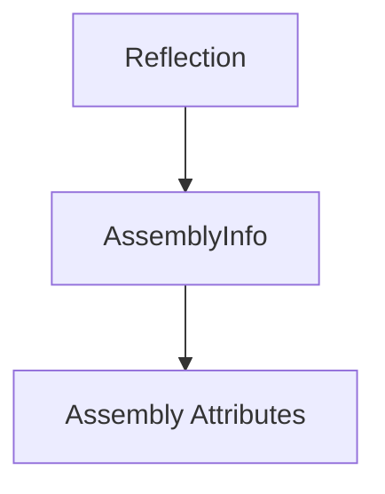

# Component: Emby.Server.Implementations.Reflection

**Path:** `Emby.Server.Implementations/Reflection/`
**Type:** Directory | Sub-Module
**Language:** C#
**Maps to:** `.discovery/205-emby-server-impl-reflection.md`

## Description

Assembly reflection utilities. Contains assembly metadata and version information.

## Directory Structure

```
Emby.Server.Implementations/Reflection/
└── AssemblyInfo.cs
```

## Files

| File | Description |
|------|-------------|
| `AssemblyInfo.cs` | Assembly metadata attributes |

## Decomposition

### AssemblyInfo.cs

#### Classes
No public classes — contains only assembly attributes

#### Attributes
| Attribute | Description |
|-----------|-------------|
| `AssemblyTitle` | Assembly title |
| `AssemblyVersion` | Assembly version |
| `AssemblyFileVersion` | File version |

## Architecture



## Dependencies

- System.Reflection — Reflection APIs

## Statistics

| Metric | Value |
|--------|-------|
| C# Files | 1 |
| Lines | ~20 |
| Public Classes | 0 |
