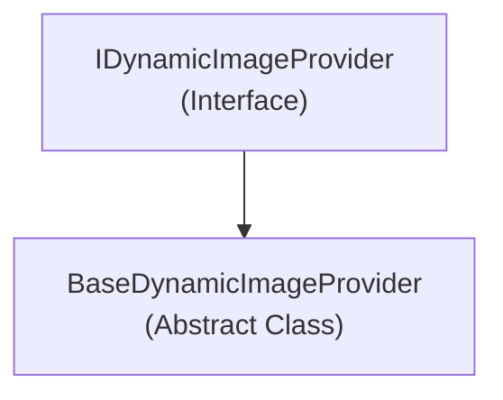

# Emby.Server.Implementations - Images Module

**Module:** Emby.Server.Implementations/Images
**Language:** C#
**Maps to:** `.discovery/206-emby-server-impl-images.md`

## Decomposition

### BaseDynamicImageProvider.cs (Base Dynamic Image Provider)

#### Imports
```csharp
using System.Threading.Tasks;
using MediaBrowser.Controller.Entities;
using MediaBrowser.Controller.Providers;
using MediaBrowser.Model.Entities;
using MediaBrowser.Model.Logging;
```

#### Classes
`BaseDynamicImageProvider` (public abstract class : IDynamicImageProvider)

#### Key Methods
```csharp
Task<DynamicImageResponse> GetImage responses(BaseItem item, ImageType type)
abstract DynamicImageInfo GetLearnedBrandImage(BaseItem item)
abstract bool Supports(BaseItem item);
```

## Architecture



## File Listing

```
Images/
└── BaseDynamicImageProvider.cs - Base class for dynamic image generation
```

## Description

Images module provides base classes for dynamic image generation. BaseDynamicImageProvider is an abstract base class that image providers (like backdrop or poster generators) can inherit from to create dynamic artwork.

## Dependencies

- **MediaBrowser.Controller.Entities** - Base entities
- **MediaBrowser.Controller.Providers** - Provider interfaces
- **MediaBrowser.Model.Entities** - Entity models

## Statistics

- **Files:** 1
- **Lines:** ~100
- **Classes:** 1
