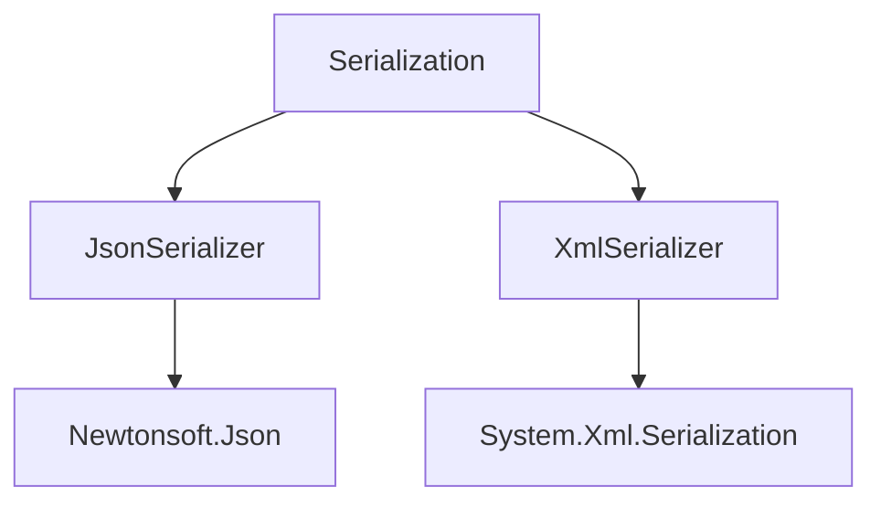

# Component: Emby.Server.Implementations.Serialization

**Path:** `Emby.Server.Implementations/Serialization/`
**Type:** Directory | Sub-Module
**Language:** C#
**Maps to:** `.discovery/206-emby-server-impl-serialization.md`

## Description

Serialization implementations for JSON and XML. Provides custom serializers for data persistence and API responses.

## Directory Structure

```
Emby.Server.Implementations/Serialization/
├── JsonSerializer.cs
└── XmlSerializer.cs
```

## Files

| File | Description |
|------|-------------|
| `JsonSerializer.cs` | JSON serialization |
| `XmlSerializer.cs` | XML serialization |

## Decomposition

### JsonSerializer.cs

#### Classes
`JsonSerializer` (public class : IJsonSerializer)

#### Key Methods
| Method | Return | Description |
|--------|--------|-------------|
| `SerializeToString<T>(T)` | `string` | Serialize to string |
| `DeserializeFromString<T>(string)` | `T` | Deserialize from string |
| `SerializeToStream<T>(T, Stream)` | `void` | Serialize to stream |

### XmlSerializer.cs

#### Classes
`XmlSerializer` (public class : IXmlSerializer)

#### Key Methods
| Method | Return | Description |
|--------|--------|-------------|
| `SerializeToFile<T>(T, string)` | `void` | Serialize to file |
| `DeserializeFromFile<T>(string)` | `T` | Deserialize from file |

## Architecture



## Dependencies

- MediaBrowser.Model.Serialization — Serialization interfaces
- Newtonsoft.Json — JSON library
- System.Xml.Serialization — XML serialization

## Statistics

| Metric | Value |
|--------|-------|
| C# Files | 2 |
| LOC | ~13,000 |
| Public Classes | 2 |
