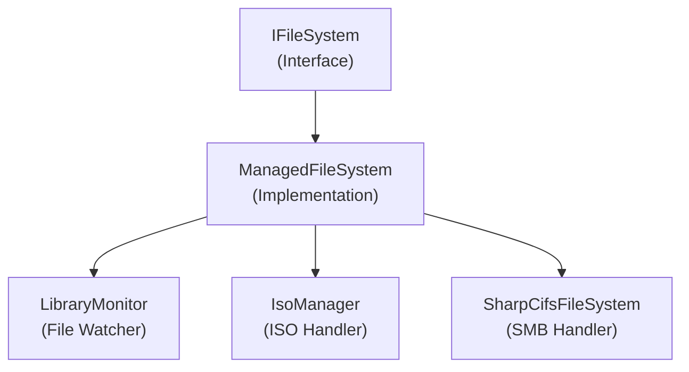

# Emby.Server.Implementations - IO Module

**Module:** Emby.Server.Implementations/IO
**Language:** C#
**Maps to:** `.discovery/207-emby-server-impl-io.md`

## Decomposition

### ManagedFileSystem.cs (Main File System Manager)

#### Imports
```csharp
using System;
using System.Collections.Generic;
using System.IO;
using System.Threading;
using System.Threading.Tasks;
using MediaBrowser.Model.IO;
```

#### Classes
`ManagedFileSystem` (public class : IFileSystem)

#### Key Properties
```csharp
IApplicationPaths ApplicationPaths { get; }
```

#### Key Methods
```csharp
FileSystemMetadata GetFileSystemInfo(string path)
Stream OpenRead(string path)
Stream OpenWrite(string path)
void CreateDirectory(string path)
void DeleteFile(string path)
void DeleteDirectory(string path, bool recursive)
bool FileExists(string path)
bool DirectoryExists(string path)
long GetFileSize(string path)
DateTime GetLastWriteTimeUtc(string path)
bool AreEqual(string path1, string path2)
bool ContainsSubPath(string parentPath, string childPath)
```

### LibraryMonitor.cs (File System Monitor)

#### Classes
`LibraryMonitor` (public class : ILibraryMonitor, IDisposable)

#### Key Methods
```csharp
void StartWatchingLocation(string path, ILibraryMonitorCallback callback)
void StopWatchingLocation(string path, ILibraryMonitorCallback callback)
void ProcessFileSystemEntryChanges(...)
```

### FileRefresher.cs (File Change Refresher)

#### Classes
`FileRefresher` (public class : IDisposable)

### ThrottledStream.cs (Rate-Limited Stream)

#### Classes
`ThrottledStream` (public class : Stream)

### IsoManager.cs (ISO Image Manager)

#### Classes
`IsoManager` (public class : IIsoManager)

### SharpCifsFileSystem.cs (SMB/CIFS File System)

#### Classes
`SharpCifsFileSystem` (public class : IFileSystem)

## Architecture



## File Listing

```
IO/
├── ManagedFileSystem.cs     - Main file system implementation
├── LibraryMonitor.cs       - Library file monitoring
├── FileRefresher.cs        - File change tracking
├── ThrottledStream.cs      - Rate-limited streaming
├── IsoManager.cs           - ISO image handling
├── SharpCifsFileSystem.cs  - SMB/CIFS support
├── StreamHelper.cs         - Stream utilities
├── ExtendedFileSystemInfo.cs - Extended file info
├── MbLinkShortcutHandler.cs  - Windows shortcut handling
└── SharpCifs/              - CIFS library subdirectory
```

## Description

IO module provides file system operations and monitoring for Emby Server. ManagedFileSystem implements file operations (read, write, delete). LibraryMonitor watches media directories for changes. IsoManager handles ISO image mounting. SharpCifsFileSystem provides SMB/CIFS network share access.

## Dependencies

- **MediaBrowser.Model.IO** - I/O interfaces
- **SharpCifs** - SMB/CIFS protocol implementation

## Statistics

- **Files:** 9 + SharpCifs subdirectory
- **Lines:** ~2,000
- **Classes:** 6
