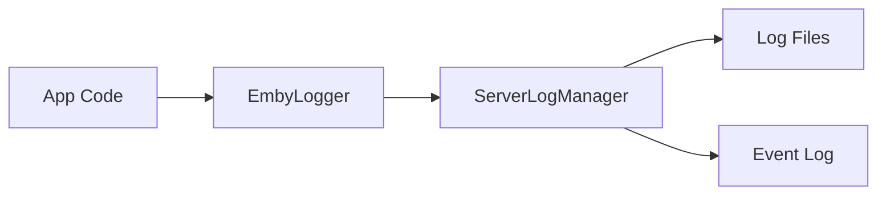

# Component: Emby.Server.Implementations — Logging

**Path:** `Emby.Server.Implementations/Logging/`
**Type:** Directory | Module
**Language:** C#
**Maps to:** `.discovery/207-emby-server-impl-logging.md`

## Description

Logging infrastructure for Emby Server. Provides structured logging with file rotation and multiple output targets.

## Files

- `EmbyLogger.cs` — Emby.Server.Implementations/Logging/EmbyLogger.cs
- `ServerEventLog.cs` — Emby.Server.Implementations/Logging/ServerEventLog.cs
- `ServerLogManager.cs` — Emby.Server.Implementations/Logging/ServerLogManager.cs

## Decomposition

### EmbyLogger.cs (Emby Logger)

#### Imports
```csharp
using Microsoft.Extensions.Logging;
using System;
using System.IO;
```

#### Classes
`EmbyLogger` (public class : ILogger)

#### Key Properties
| Property | Type | Description |
|----------|------|-------------|
| `CategoryName` | `string` | Log category |
| `LogLevel` | `LogLevel` | Current level |

#### Key Methods
| Method | Return | Description |
|--------|--------|-------------|
| `Log(LogLevel, EventId, object, Exception, Func<object,Exception,string>)` | `void` | Log message |
| `BeginScope<TState>(TState)` | `IDisposable` | Create scope |

### ServerLogManager.cs (Log Manager)

#### Classes
`ServerLogManager` (public class : IServerLogManager)

#### Key Properties
| Property | Type | Description |
|----------|------|-------------|
| `LogFilePath` | `string` | Main log file |
| `LogSeverity` | `LogLevel` | Min log level |

#### Key Methods
| Method | Return | Description |
|--------|--------|-------------|
| `GetLogger(string)` | `ILogger` | Get logger instance |
| `Flush()` | `void` | Flush all logs |
| `RotateLogFile()` | `void` | Rotate log file |

### ServerEventLog.cs (Event Log)

#### Classes
`ServerEventLog` (public class)

#### Key Properties
| Property | Type | Description |
|----------|------|-------------|
| `Entries` | `IList<LogRow>` | Log entries |

#### Key Methods
| Method | Return | Description |
|--------|--------|-------------|
| `GetLogEntries(DateTime?, DateTime?)` | `IEnumerable<LogRow>` | Get entries |
| `AddLogMessage(LogSeverity, string, string)` | `void` | Add entry |

## Data Flow



## Dependencies

- `Microsoft.Extensions.Logging` — Logging abstractions
- `System.IO` — File logging

## Statistics

| Metric | Value |
|--------|-------|
| Files | 3 |
| Classes | 3 |
| LOC | ~200 |
