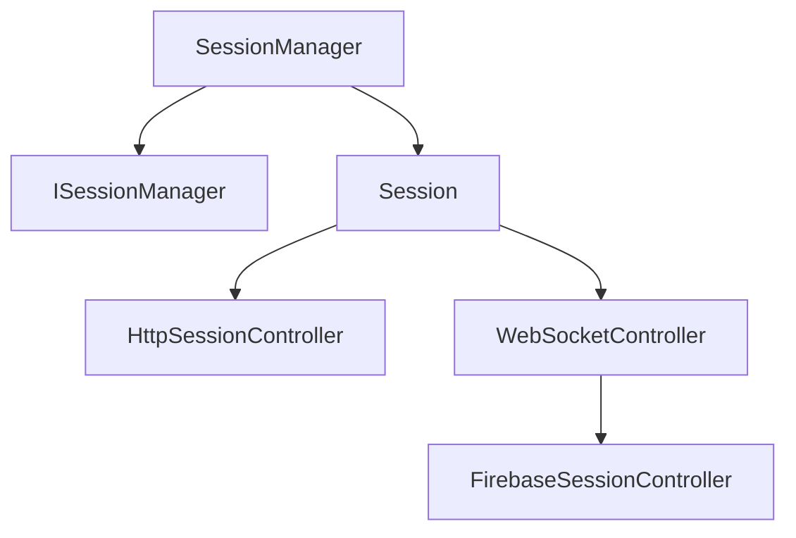

# Component: Emby.Server.Implementations.Session

**Path:** `Emby.Server.Implementations/Session/`
**Type:** Directory | Sub-Module
**Language:** C#
**Maps to:** `.discovery/207-emby-server-impl-session.md`

## Description

Session management for client connections. Handles authentication sessions, WebSocket sessions, and session state for clients connecting to the server.

## Directory Structure

```
Emby.Server.Implementations/Session/
├── FirebaseSessionController.cs
├── HttpSessionController.cs
├── SessionManager.cs
├── SessionWebSocketListener.cs
└── WebSocketController.cs
```

## Files

| File | Description |
|------|-------------|
| `SessionManager.cs` | Core session management |
| `HttpSessionController.cs` | HTTP session handling |
| `WebSocketController.cs` | WebSocket session control |
| `SessionWebSocketListener.cs` | WebSocket event listener |
| `FirebaseSessionController.cs` | Firebase push notifications |

## Decomposition

### SessionManager.cs

#### Classes
`SessionManager` (public class : ISessionManager)

#### Key Properties
| Property | Type | Description |
|----------|------|-------------|
| `Sessions` | `IEnumerable<SessionInfo>` | Active sessions |

#### Key Methods
| Method | Return | Description |
|--------|--------|-------------|
| `CreateSession(string, string)` | `Session` | Create new session |
| `LogSessionActivity(Guid, string, string, string)` | `Task` | Log session activity |
| `SendMessageToSession(Guid, string, string, CancellationToken)` | `Task` | Send message |

### HttpSessionController.cs

#### Classes
`HttpSessionController` (public class)

#### Key Methods
| Method | Return | Description |
|--------|--------|-------------|
| `Authenticate(HttpRequest)` | `AuthenticationResult` | Authenticate request |
| `CreateSession(HttpRequest)` | `Session` | Create HTTP session |

## Architecture



## Dependencies

- MediaBrowser.Controller.Session — Session interfaces
- MediaBrowser.Model.Logging — Logging
- System.Net.WebSockets — WebSocket APIs

## Statistics

| Metric | Value |
|--------|-------|
| C# Files | 5 |
| LOC | ~80,000 |
| Public Classes | 4 |
