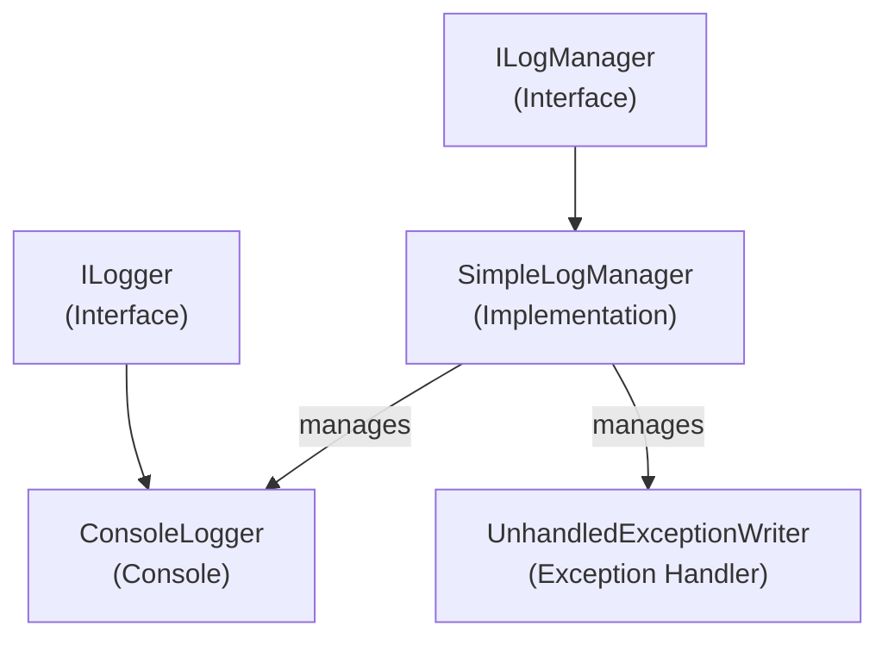

# Emby.Server.Implementations - Logging Module

**Module:** Emby.Server.Implementations/Logging
**Language:** C#
**Maps to:** `.discovery/208-emby-server-impl-logging.md`

## Decomposition

### SimpleLogManager.cs (Main Logging Manager)

#### Imports
```csharp
using System;
using System.Collections.Generic;
using System.IO;
using System.Linq;
using System.Threading;
using MediaBrowser.Model.IO;
using MediaBrowser.Model.Logging;
```

#### Classes
`SimpleLogManager` (public class : ILogManager)

#### Key Properties
```csharp
ILogger NullLogger { get; }
```

#### Key Methods
```csharp
void AddLogger(ILogger logger)
void RemoveLogger(ILogger logger)
ILogger GetLogger(string name)
IEnumerable<ILogger> Loggers { get; }
```

### ConsoleLogger.cs (Console Output Logger)

#### Classes
`ConsoleLogger` (public class : ILogger, IDisposable)

### UnhandledExceptionWriter.cs (Exception Handler)

#### Classes
`UnhandledExceptionWriter` (public class)

## Architecture



## File Listing

```
Logging/
├── SimpleLogManager.cs       - Main logging manager
├── ConsoleLogger.cs          - Console output logger
└── UnhandledExceptionWriter.cs - Unhandled exception handler
```

## Description

Logging module provides logging infrastructure for Emby Server. SimpleLogManager manages multiple loggers and provides logger instances. ConsoleLogger outputs to console. UnhandledExceptionWriter catches and logs unhandled exceptions.

## Dependencies

- **MediaBrowser.Model.Logging** - Logging interfaces
- **MediaBrowser.Model.IO** - File system access

## Statistics

- **Files:** 3
- **Lines:** ~300
- **Classes:** 3
