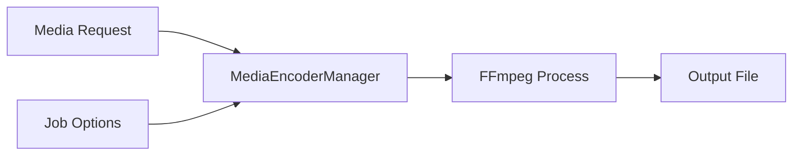

# Component: Emby.Server.Implementations — MediaEncoder

**Path:** `Emby.Server.Implementations/MediaEncoder/`
**Type:** Directory | Module
**Language:** C#
**Maps to:** `.discovery/208-emby-server-impl-mediaencoder.md`

## Description

FFmpeg-based media encoding and transcoding. Provides video/audio encoding capabilities using external FFmpeg binaries.

## Files

- `MediaEncoderManager.cs` — Emby.Server.Implementations/MediaEncoder/MediaEncoderManager.cs

## Decomposition

### MediaEncoderManager.cs (Media Encoder Manager)

#### Imports
```csharp
using MediaBrowser.Controller.MediaEncoding;
using MediaBrowser.Model.MediaEncoding;
using System;
using System.Collections.Generic;
using System.Diagnostics;
using System.Threading.Tasks;
```

#### Classes
`MediaEncoderManager` (public class : IMediaEncoder)

#### Key Properties
| Property | Type | Description |
|----------|------|-------------|
| `FFmpegPath` | `string` | FFmpeg executable path |
| `EncoderVersion` | `string` | FFmpeg version |

#### Key Methods
| Method | Return | Description |
|--------|--------|-------------|
| `Encode(MediaEncodingJobOptions)` | `Task<EncodingJobResult>` | Encode media |
| `ExtractAudio(MediaEncodingJobOptions)` | `Task<string>` | Extract audio track |
| `GetMediaInfo(string)` | `Task<MediaInfo>` | Get media info |
| `EncodeThumbnail(string, TimeSpan)` | `Task<string>` | Create thumbnail |
| `CanEncode(string)` | `bool` | Check if encoding supported |

#### Key Events
| Event | Description |
|-------|-------------|
| `EncodingStarted` | Encoding job started |
| `EncodingCompleted` | Encoding job finished |
| `EncodingProgress` | Progress update |

## Data Flow



## Dependencies

- `System.Diagnostics` — Process management
- `MediaBrowser.Controller.MediaEncoding` — Encoding interfaces
- `FFmpeg` — External transcoding binary

## Statistics

| Metric | Value |
|--------|-------|
| Files | 1 |
| Classes | 1 |
| LOC | ~350 |
