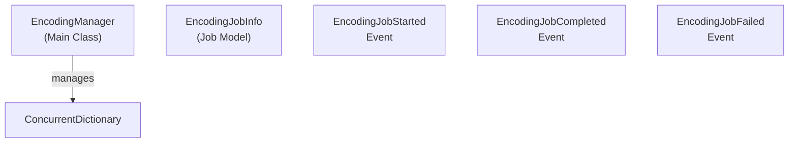

# Emby.Server.Implementations - MediaEncoder Module

**Module:** Emby.Server.Implementations/MediaEncoder
**Language:** C#
**Maps to:** `.discovery/209-emby-server-impl-mediaencoder.md`

## Decomposition

### EncodingManager.cs (Encoding Job Manager)

#### Imports
```csharp
using System;
using System.Collections.Concurrent;
using System.Collections.Generic;
using System.Linq;
using System.Threading;
using System.Threading.Tasks;
using MediaBrowser.Model.Configuration;
using MediaBrowser.Model.Dlna;
using MediaBrowser.Model.IO;
using MediaBrowser.Model.Logging;
using MediaBrowser.Model.MediaInfo;
```

#### Classes
`EncodingManager` (public class : IServerEntryPoint)

#### Key Properties
```csharp
ConcurrentDictionary<string, EncodingJobInfo> ActiveJobs { get; }
```

#### Key Methods
```csharp
Task<EncodingJobInfo> StartEncodingJob(...)
void StopEncodingJob(string jobId, bool enableThrottling)
event EventHandler<EncodingJobOptions> EncodingJobStarted
event EventHandler<EncodingJobOptions> EncodingJobCompleted
event EventHandler<EncodingJobOptions> EncodingJobFailed
```

## Architecture



## File Listing

```
MediaEncoder/
└── EncodingManager.cs - Media encoding job management
```

## Description

MediaEncoder module manages media encoding jobs. EncodingManager handles starting, stopping, and tracking encoding jobs. It fires events when jobs start, complete, or fail.

## Dependencies

- **MediaBrowser.Model.MediaInfo** - Media information models
- **MediaBrowser.Model.Configuration** - Configuration models
- **MediaBrowser.Model.Dlna** - DLNA models

## Statistics

- **Files:** 1
- **Lines:** ~500
- **Classes:** 1
