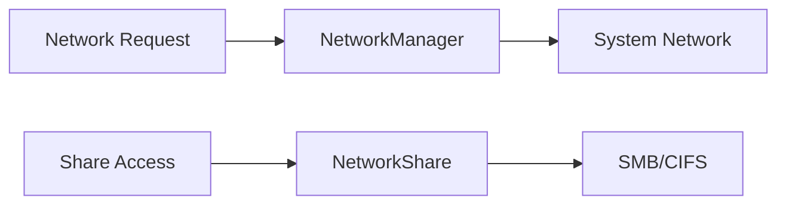

# Component: Emby.Server.Implementations — Net

**Path:** `Emby.Server.Implementations/Net/`
**Type:** Directory | Module
**Language:** C#
**Maps to:** `.discovery/209-emby-server-impl-net.md`

## Description

Network utilities for Emby Server. Provides network information, interface discovery, and socket management.

## Files

- `HttpListenerAppHost.cs` — Emby.Server.Implementations/Net/HttpListenerAppHost.cs
- `ManagedHttpRequest.cs` — Emby.Server.Implementations/Net/ManagedHttpRequest.cs
- `NetworkManager.cs` — Emby.Server.Implementations/Net/NetworkManager.cs
- `NetworkShare.cs` — Emby.Server.Implementations/Net/NetworkShare.cs

## Decomposition

### NetworkManager.cs (Network Manager)

#### Imports
```csharp
using MediaBrowser.Model.Net;
using System;
using System.Collections.Generic;
using System.Linq;
using System.Net;
using System.Net.NetworkInformation;
```

#### Classes
`NetworkManager` (public class : INetworkManager)

#### Key Properties
| Property | Type | Description |
|----------|------|-------------|
| `NetworkInterfaces` | `IEnumerable<NetworkInterfaceInfo>` | All interfaces |
| `LocalIpAddresses` | `IEnumerable<IPAddress>` | Local IPs |

#### Key Methods
| Method | Return | Description |
|--------|--------|-------------|
| `GetNetworkInterfaces()` | `IEnumerable<NetworkInterfaceInfo>` | Get all NICs |
| `GetLocalIpAddresses()` | `IEnumerable<IPAddress>` | Get local IPs |
| `ParseHostsFile()` | `IEnumerable<HostsFileEntry>` | Parse hosts file |
| `GetMacAddress(IPAddress)` | `string` | Get MAC address |

### NetworkShare.cs (Network Share)

#### Classes
`NetworkShare` (public class : IDisposable)

#### Key Methods
| Method | Return | Description |
|--------|--------|-------------|
| `Connect(string, string, string)` | `void` | Connect to share |
| `Disconnect()` | `void` | Disconnect share |
| `GetFiles(string, string)` | `IEnumerable<string>` | List files |

### HttpListenerAppHost.cs (HTTP Listener App Host)

#### Classes
`HttpListenerAppHost` (public class : IHttpHost)

#### Key Properties
| Property | Type | Description |
|----------|------|-------------|
| `ListenUrls` | `string[]` | Listening URLs |

#### Key Methods
| Method | Return | Description |
|--------|--------|-------------|
| `Start(string[])` | `void` | Start listening |
| `Stop()` | `void` | Stop listening |

## Data Flow



## Dependencies

- `System.Net` — Network types
- `System.Net.NetworkInformation` — Interface discovery

## Statistics

| Metric | Value |
|--------|-------|
| Files | 4 |
| Classes | 4 |
| LOC | ~300 |
