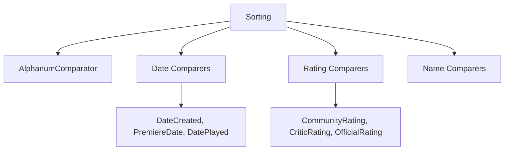

# Component: Emby.Server.Implementations.Sorting

**Path:** `Emby.Server.Implementations/Sorting/`
**Type:** Directory | Sub-Module
**Language:** C#
**Maps to:** `.discovery/209-emby-server-impl-sorting.md`

## Description

Item comparers for sorting media collections. Provides 28 different sorting comparers for various media types and metadata fields.

## Directory Structure

```
Emby.Server.Implementations/Sorting/
├── AiredEpisodeOrderComparer.cs
├── AlbumArtistComparer.cs
├── AlbumComparer.cs
├── AlphanumComparator.cs
├── ArtistComparer.cs
├── CommunityRatingComparer.cs
├── CriticRatingComparer.cs
├── DateCreatedComparer.cs
├── DateLastMediaAddedComparer.cs
├── DatePlayedComparer.cs
├── GameSystemComparer.cs
├── IsFavoriteOrLikeComparer.cs
├── IsFolderComparer.cs
├── IsPlayedComparer.cs
├── IsUnplayedComparer.cs
├── NameComparer.cs
├── OfficialRatingComparer.cs
├── PlayCountComparer.cs
├── PlayersComparer.cs
├── PremiereDateComparer.cs
├── ProductionYearComparer.cs
├── RandomComparer.cs
├── RuntimeComparer.cs
├── SeriesSortNameComparer.cs
├── SortNameComparer.cs
├── StartDateComparer.cs
└── StudioComparer.cs
```

## Files

| File | Description |
|------|-------------|
| `NameComparer.cs` | Sort by name |
| `AlphanumComparator.cs` | Alphanumeric sorting |
| `DateCreatedComparer.cs` | Sort by date created |
| `PremiereDateComparer.cs` | Sort by premiere date |
| `RuntimeComparer.cs` | Sort by runtime |
| `CommunityRatingComparer.cs` | Sort by community rating |
| `IsFolderComparer.cs` | Sort folders first/last |

## Decomposition

### AlphanumComparator.cs

#### Classes
`AlphanumComparator` (public class : IComparer<string>)

#### Key Methods
| Method | Return | Description |
|--------|--------|-------------|
| `Compare(string, string)` | `int` | Compare strings alphanumerically |

### RandomComparer.cs

#### Classes
`RandomComparer` (public class : IComparer<BaseItem>)

#### Key Methods
| Method | Return | Description |
|--------|--------|-------------|
| `Compare(BaseItem, BaseItem)` | `int` | Random comparison |

## Architecture



## Dependencies

- MediaBrowser.Controller.Entities — Entity types
- System.Collections.Generic — Comparer interfaces

## Statistics

| Metric | Value |
|--------|-------|
| C# Files | 28 |
| LOC | ~10,000 |
| Public Classes | 28 |
