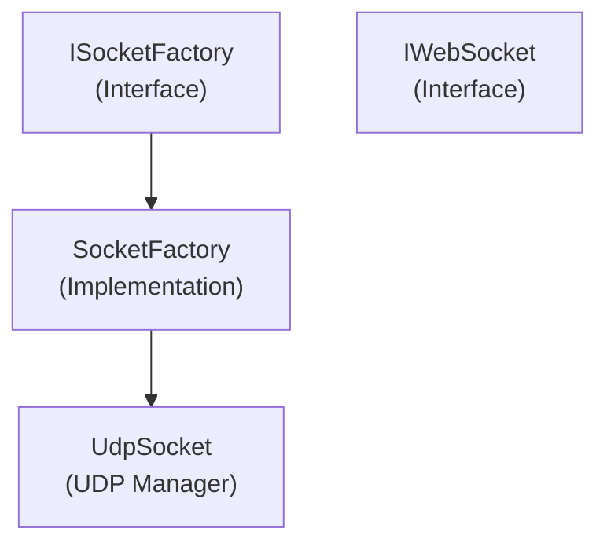

# Emby.Server.Implementations - Net Module

**Module:** Emby.Server.Implementations/Net
**Language:** C#
**Maps to:** `.discovery/210-emby-server-impl-net.md`

## Decomposition

### UdpSocket.cs (UDP Socket Manager)

#### Imports
```csharp
using System;
using System.Net;
using System.Net.Sockets;
using System.Threading;
using System.Threading.Tasks;
using MediaBrowser.Model.Logging;
```

#### Classes
`UdpSocket` (public class : IDisposable)

#### Key Methods
```csharp
void Init(IPAddress address, int port)
void Send(byte[] buffer, IPEndPoint remoteEndpoint)
event EventHandler<UdpSocketMessageEventArgs> MessageReceived
```

### SocketFactory.cs (Socket Factory)

#### Classes
`SocketFactory` (public class : ISocketFactory)

#### Key Methods
```csharp
UdpSocket CreateUdpSocket()
```

### IWebSocket.cs (WebSocket Interface)

#### Classes
`IWebSocket` (public interface)

### DisposableManagedObjectBase.cs (Base Disposable)

#### Classes
`DisposableManagedObjectBase` (public abstract class : IDisposable)

## Architecture



## File Listing

```
Net/
├── UdpSocket.cs              - UDP socket communication
├── SocketFactory.cs          - Socket creation factory
├── IWebSocket.cs            - WebSocket interface
├── WebSocketConnectEventArgs.cs - WebSocket events
└── DisposableManagedObjectBase.cs - Base disposable class
```

## Description

Net module provides low-level networking utilities. UdpSocket manages UDP socket communication. SocketFactory creates socket instances. IWebSocket defines WebSocket contract.

## Dependencies

- **System.Net.Sockets** - Socket programming
- **MediaBrowser.Model.Logging** - Logging

## Statistics

- **Files:** 5
- **Lines:** ~400
- **Classes:** 4
