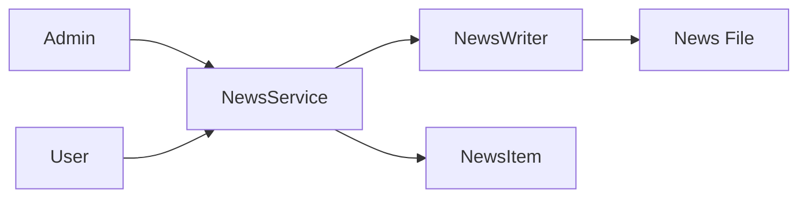

# Component: Emby.Server.Implementations — News

**Path:** `Emby.Server.Implementations/News/`
**Type:** Directory | Module
**Language:** C#
**Maps to:** `.discovery/210-emby-server-impl-news.md`

## Description

News feed management for Emby Server. Provides news aggregation and display functionality.

## Files

- `NewsService.cs` — Emby.Server.Implementations/News/NewsService.cs
- `NewsWriter.cs` — Emby.Server.Implementations/News/NewsWriter.cs

## Decomposition

### NewsService.cs (News Service)

#### Imports
```csharp
using MediaBrowser.Controller.Net;
using MediaBrowser.Model.News;
using System.Collections.Generic;
using System.Threading.Tasks;
```

#### Classes
`NewsService` (public class : IAsyncRestfulService)

#### Key Methods
| Method | Return | Description |
|--------|--------|-------------|
| `Get(GetNewsRequest)` | `Task<IEnumerable<NewsItem>>` | Get news items |
| `Post(NewsWriterRequest)` | `Task` | Write news item |

### NewsWriter.cs (News Writer)

#### Classes
`NewsWriter` (public class)

#### Key Properties
| Property | Type | Description |
|----------|------|-------------|
| `NewsFilePath` | `string` | Path to news file |

#### Key Methods
| Method | Return | Description |
|--------|--------|-------------|
| `WriteNews(string, string)` | `void` | Write news entry |
| `DeleteNews(string)` | `void` | Delete news entry |

## Data Flow



## Dependencies

- `MediaBrowser.Model.News` — News models
- `System.IO` — File operations

## Statistics

| Metric | Value |
|--------|-------|
| Files | 2 |
| Classes | 2 |
| LOC | ~80 |
