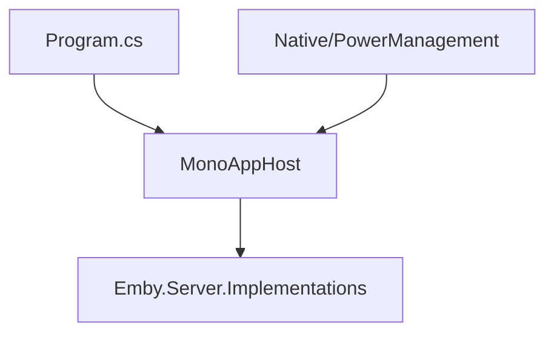

# Component: MediaBrowser.Server.Mono

**Path:** `MediaBrowser.Server.Mono/`
**Type:** Directory | Application
**Language:** C#
**Maps to:** `.discovery/210-mediabrowser-server-mono.md`

## Description

Mono runtime launcher for Emby Server. Provides platform-specific implementations for Linux/macOS environments.

## Files

### Root Files

- `ApplicationPathHelper.cs` — MediaBrowser.Server.Mono/ApplicationPathHelper.cs
- `ImageEncoderHelper.cs` — MediaBrowser.Server.Mono/ImageEncoderHelper.cs
- `ImageMagickSharp.dll.config` — MediaBrowser.Server.Mono/ImageMagickSharp.dll.config
- `MediaBrowser.Server.Mono.csproj` — MediaBrowser.Server.Mono/MediaBrowser.Server.Mono.csproj
- `MonoAppHost.cs` — MediaBrowser.Server.Mono/MonoAppHost.cs
- `Program.cs` — MediaBrowser.Server.Mono/Program.cs
- `Properties/AssemblyInfo.cs` — MediaBrowser.Server.Mono/Properties/AssemblyInfo.cs
- `SQLitePCLRaw.provider.sqlite3.dll.config` — MediaBrowser.Server.Mono/SQLitePCLRaw.provider.sqlite3.dll.config
- `SkiaSharp.dll.config` — MediaBrowser.Server.Mono/SkiaSharp.dll.config
- `app.config` — MediaBrowser.Server.Mono/app.config
- `packages.config` — MediaBrowser.Server.Mono/packages.config

### Native/

- `PowerManagement.cs` — MediaBrowser.Server.Mono/Native/PowerManagement.cs

## Architecture

## Key Classes

| Class | Responsibility |
|-------|----------------|
| `MonoAppHost` | Mono-specific application host |
| `Program` | Entry point |
| `ApplicationPathHelper` | Path resolution |
| `ImageEncoderHelper` | Image encoder setup |
| `PowerManagement` | System power control |

## Dependencies

- Emby.Server.Implementations
- MediaBrowser.Model
