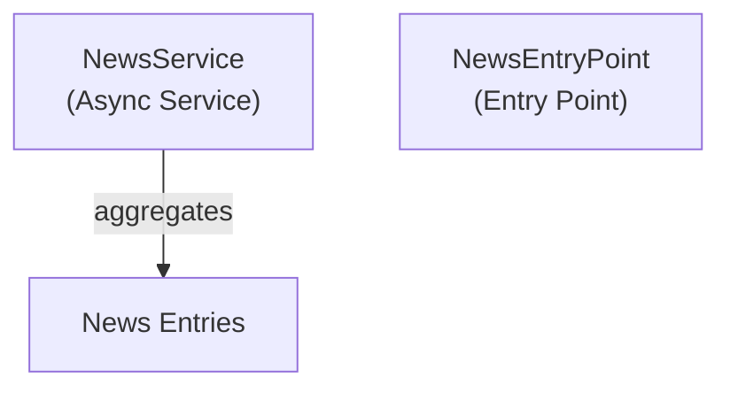

# Emby.Server.Implementations - News Module

**Module:** Emby.Server.Implementations/News
**Language:** C#
**Maps to:** `.discovery/211-emby-server-impl-news.md`

## Decomposition

### NewsService.cs (News Aggregation Service)

#### Imports
```csharp
using MediaBrowser.Controller.Net;
using MediaBrowser.Model.Logging;
using System.Threading.Tasks;
```

#### Classes
`NewsService` (public class : IAsyncService)

### NewsEntryPoint.cs (Server Entry Point)

#### Classes
`NewsEntryPoint` (public class : IServerEntryPoint)

## Architecture



## File Listing

```
News/
├── NewsService.cs    - News aggregation service
└── NewsEntryPoint.cs - Server entry point
```

## Description

News module provides news aggregation functionality for Emby Server. NewsService fetches and aggregates news from various sources.

## Dependencies

- **MediaBrowser.Controller.Net** - Networking interfaces
- **MediaBrowser.Model.Logging** - Logging

## Statistics

- **Files:** 2
- **Lines:** ~100
- **Classes:** 2
