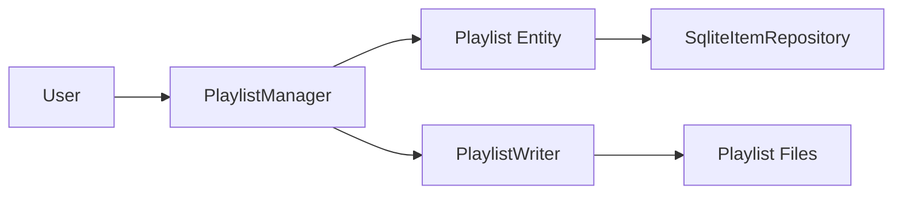

# Component: Emby.Server.Implementations — Playlists

**Path:** `Emby.Server.Implementations/Playlists/`
**Type:** Directory | Module
**Language:** C#
**Maps to:** `.discovery/211-emby-server-impl-playlists.md`

## Description

Playlist management and persistence. Handles creation, modification, and playback of media playlists.

## Files

- `PlaylistImageProvider.cs` — Emby.Server.Implementations/Playlists/PlaylistImageProvider.cs
- `PlaylistManager.cs` — Emby.Server.Implementations/Playlists/PlaylistManager.cs
- `PlaylistWriter.cs` — Emby.Server.Implementations/Playlists/PlaylistWriter.cs

## Decomposition

### PlaylistManager.cs (Playlist Manager)

#### Imports
```csharp
using MediaBrowser.Controller.Library;
using MediaBrowser.Controller.Playlists;
using MediaBrowser.Model.Entities;
using MediaBrowser.Model.Querying;
using System;
using System.Collections.Generic;
using System.Threading.Tasks;
```

#### Classes
`PlaylistManager` (public class : IPlaylistManager)

#### Key Properties
| Property | Type | Description |
|----------|------|-------------|
| `Playlists` | `IEnumerable<Playlist>` | All playlists |

#### Key Methods
| Method | Return | Description |
|--------|--------|-------------|
| `CreatePlaylist(PlaylistCreationRequest)` | `Task<Playlist>` | Create playlist |
| `AddItemToPlaylist(Guid, Guid, int?)` | `Task` | Add item |
| `RemoveItemFromPlaylist(Guid, Guid)` | `Task` | Remove item |
| `GetPlaylistItems(Guid, DtoOptions)` | `IEnumerable<BaseItem>` | Get items |
| `MoveItem(Guid, Guid, int)` | `Task` | Reorder item |
| `ClearPlaylist(Guid)` | `Task` | Remove all items |

### PlaylistImageProvider.cs (Playlist Image Provider)

#### Classes
`PlaylistImageProvider` (public class : IDynamicImageProvider)

#### Key Methods
| Method | Return | Description |
|--------|--------|-------------|
| `GetImages(Playlist, IEnumerable<ImageType>)` | `Task<IEnumerable<ItemImageInfo>>` | Get images |

### PlaylistWriter.cs (Playlist File Writer)

#### Classes
`PlaylistWriter` (public class)

#### Key Methods
| Method | Return | Description |
|--------|--------|-------------|
| `WritePlaylist(Playlist, string)` | `Task` | Export to file |
| `WriteM3UPlaylist(Playlist, string)` | `Task` | Export M3U format |
| `WriteM3U8Playlist(Playlist, string)` | `Task` | Export M3U8 format |

## Data Flow



## Dependencies

- `MediaBrowser.Controller.Library` — Library interfaces
- `MediaBrowser.Controller.Playlists` — Playlist interfaces
- `Emby.Server.Implementations.Library` — Library implementation

## Statistics

| Metric | Value |
|--------|-------|
| Files | 3 |
| Classes | 3 |
| LOC | ~250 |
