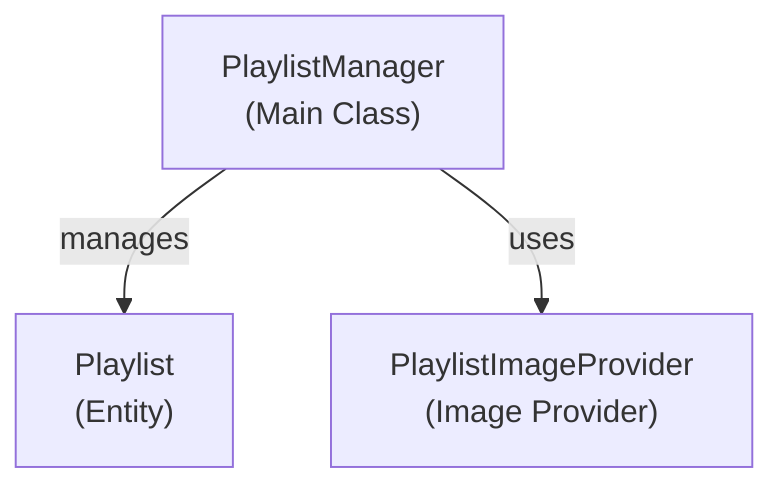

# Emby.Server.Implementations - Playlists Module

**Module:** Emby.Server.Implementations/Playlists
**Language:** C#
**Maps to:** `.discovery/212-emby-server-impl-playlists.md`

## Decomposition

### PlaylistManager.cs (Playlist Management)

#### Imports
```csharp
using MediaBrowser.Controller.Collections;
using MediaBrowser.Controller.Entities;
using MediaBrowser.Controller.Library;
using MediaBrowser.Model.Logging;
using System.Collections.Generic;
using System.Threading.Tasks;
```

#### Classes
`PlaylistManager` (public class : IPlaylistFolder)

#### Key Properties
```csharp
Folder RootFolder { get; }
```

#### Key Methods
```csharp
Task<Playlist> CreatePlaylist(PlaylistCreationOptions options)
void AddItemToPlaylist(string playlistId, IEnumerable<string> items)
void RemoveItemFromPlaylist(string playlistId, IEnumerable<string> items)
```

### PlaylistImageProvider.cs (Playlist Images)

#### Classes
`PlaylistImageProvider` (public class : ILocalImageProvider)

### ManualPlaylistsFolder.cs (Manual Playlist Container)

#### Classes
`ManualPlaylistsFolder` (public class : Folder)

## Architecture



## File Listing

```
Playlists/
├── PlaylistManager.cs      - Playlist management
├── PlaylistImageProvider.cs - Playlist image provider
└── ManualPlaylistsFolder.cs - Manual playlist container
```

## Description

Playlists module manages media playlists. PlaylistManager handles creating, adding items to, and removing items from playlists. Playlists are represented as Playlist entities with image support.

## Dependencies

- **MediaBrowser.Controller.Collections** - Collection interfaces
- **MediaBrowser.Controller.Library** - Library management

## Statistics

- **Files:** 3
- **Lines:** ~400
- **Classes:** 3
