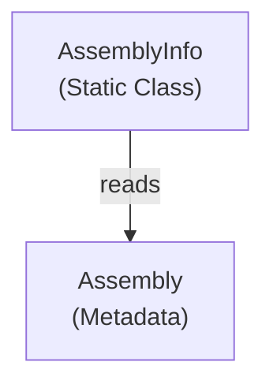

# Emby.Server.Implementations - Reflection Module

**Module:** Emby.Server.Implementations/Reflection
**Language:** C#
**Maps to:** `.discovery/213-emby-server-impl-reflection.md`

## Decomposition

### AssemblyInfo.cs (Assembly Information Provider)

#### Imports
```csharp
using System;
using System.Reflection;
```

#### Classes
`AssemblyInfo` (public static class)

#### Key Properties
```csharp
string CurrentAssemblyName
Version CurrentAssemblyVersion
```

## Architecture



## File Listing

```
Reflection/
└── AssemblyInfo.cs - Assembly metadata provider
```

## Description

Reflection module provides assembly metadata utilities. AssemblyInfo provides information about the current assembly like name and version.

## Dependencies

- **System.Reflection** - .NET reflection APIs

## Statistics

- **Files:** 1
- **Lines:** ~50
- **Classes:** 1
