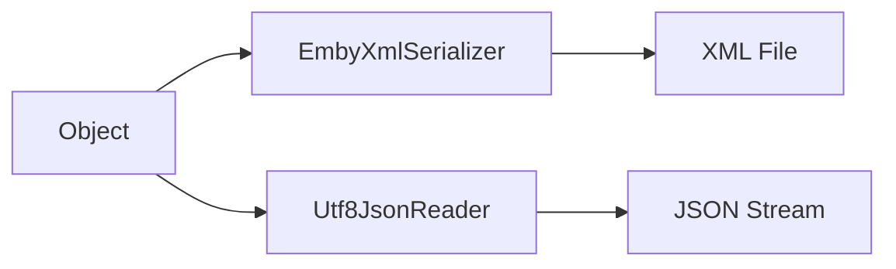

# Component: Emby.Server.Implementations — Serialization

**Path:** `Emby.Server.Implementations/Serialization/`
**Type:** Directory | Module
**Language:** C#
**Maps to:** `.discovery/213-emby-server-impl-serialization.md`

## Description

JSON serialization infrastructure. Provides custom JSON serialization for Emby data types.

## Files

- `EmbyXmlSerializer.cs` — Emby.Server.Implementations/Serialization/EmbyXmlSerializer.cs
- `Utf8JsonReader.cs` — Emby.Server.Implementations/Serialization/Utf8JsonReader.cs

## Decomposition

### EmbyXmlSerializer.cs (XML Serializer)

#### Imports
```csharp
using System;
using System.IO;
using System.Xml;
using System.Xml.Serialization;
```

#### Classes
`EmbyXmlSerializer` (public class : IXmlSerializer)

#### Key Methods
| Method | Return | Description |
|--------|--------|-------------|
| `SerializeToString<T>(T)` | `string` | Serialize to XML |
| `DeserializeFromString<T>(string)` | `T` | Deserialize from XML |
| `SerializeToFile<T>(T, string)` | `void` | Serialize to file |
| `DeserializeFromFile<T>(string)` | `T` | Deserialize from file |
| `DeserializeFromStream<T>(Stream)` | `T` | Deserialize from stream |

### Utf8JsonReader.cs (UTF-8 JSON Reader)

#### Imports
```csharp
using System;
using System.Buffers;
using System.Buffers.Text;
using System.Text.Json;
```

#### Classes
`Utf8JsonReader` (public struct)

#### Key Methods
| Method | Return | Description |
|--------|--------|-------------|
| `Read()` | `bool` | Read next token |
| `TryGetDateTime(out DateTime)` | `bool` | Parse datetime |
| `GetString()` | `string` | Get string value |

## Data Flow



## Dependencies

- `System.Xml` — XML serialization
- `System.Text.Json` — JSON parsing

## Statistics

| Metric | Value |
|--------|-------|
| Files | 2 |
| Classes | 2 |
| LOC | ~150 |
