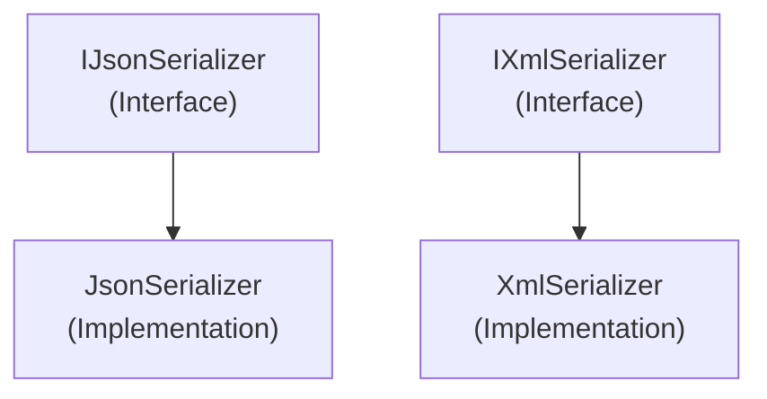

# Emby.Server.Implementations - Serialization Module

**Module:** Emby.Server.Implementations/Serialization
**Language:** C#
**Maps to:** `.discovery/214-emby-server-impl-serialization.md`

## Decomposition

### JsonSerializer.cs (JSON Serialization)

#### Imports
```csharp
using MediaBrowser.Model.Serialization;
using System;
using System.IO;
```

#### Classes
`JsonSerializer` (public class : IJsonSerializer)

#### Key Methods
```csharp
T DeserializeFromString<T>(string json)
void SerializeToFile(object obj, string path)
T DeserializeFromFile<T>(string path)
string SerializeToString(object obj)
```

### XmlSerializer.cs (XML Serialization)

#### Classes
`XmlSerializer` (public class : IXmlSerializer)

#### Key Methods
```csharp
T DeserializeFromString<T>(string xml)
void SerializeToFile(object obj, string path)
T DeserializeFromFile<T>(string path)
string SerializeToString(object obj)
```

## Architecture



## File Listing

```
Serialization/
├── JsonSerializer.cs - JSON serialization implementation
└── XmlSerializer.cs  - XML serialization implementation
```

## Description

Serialization module provides JSON and XML serialization for Emby Server. JsonSerializer handles JSON operations. XmlSerializer handles XML operations.

## Dependencies

- **MediaBrowser.Model.Serialization** - Serialization interfaces
- **System.IO** - File I/O
- **System.Text.Json** - JSON
- **System.Xml.Serialization** - XML

## Statistics

- **Files:** 2
- **Lines:** ~300
- **Classes:** 2
