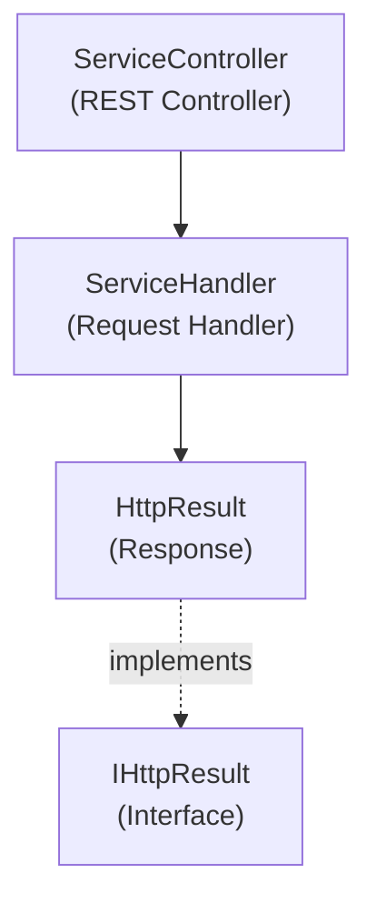

# Emby.Server.Implementations - Services Module

**Module:** Emby.Server.Implementations/Services
**Language:** C#
**Maps to:** `.discovery/215-emby-server-impl-services.md`

## Decomposition

### ServiceController.cs (REST Service Controller)

#### Imports
```csharp
using MediaBrowser.Model.Logging;
using MediaBrowser.Model.Services;
using System;
using System.Threading.Tasks;
```

#### Classes
`ServiceController` (public static class)

#### Key Methods
```csharp
Task<object> ExecuteAsync(object instance, IRequest request, string operationName)
object GetService(Type serviceType)
void RegisterService(Type serviceType, object service)
```

### ServiceHandler.cs (Service Request Handler)

#### Classes
`ServiceHandler` (public class)

#### Key Methods
```csharp
Task HandleRequestAsync(RequestInfo requestInfo)
```

### HttpResult.cs (HTTP Response)

#### Classes
`HttpResult` (public class : IHttpResult)

### RequestHelper.cs / ResponseHelper.cs (Request/Response Utilities)

#### Classes
`RequestHelper` / `ResponseHelper` (public static classes)

### ServiceMethod.cs / ServicePath.cs (REST Method Metadata)

#### Classes
`ServiceMethod` / `ServicePath` (public static classes)

### StringMapTypeDeserializer.cs (Type Deserializer)

#### Classes
`StringMapTypeDeserializer` (public static class)

### UrlExtensions.cs (URL Extensions)

#### Classes
`UrlExtensions` (public static class)

## Architecture



## File Listing

```
Services/
├── ServiceController.cs    - REST service controller
├── ServiceHandler.cs       - Service request handler
├── HttpResult.cs          - HTTP response wrapper
├── RequestHelper.cs       - Request utilities
├── ResponseHelper.cs      - Response utilities
├── ServiceExec.cs        - Service execution
├── ServiceMethod.cs       - Method metadata
├── ServicePath.cs        - Path metadata
├── StringMapTypeDeserializer.cs - Type deserializer
└── UrlExtensions.cs     - URL helpers
```

## Description

Services module implements a REST service framework similar to ServiceStack. ServiceController handles routing, ServiceHandler processes requests, and HttpResult wraps responses.

## Dependencies

- **MediaBrowser.Model.Services** - Service interfaces
- **MediaBrowser.Model.Logging** - Logging

## Statistics

- **Files:** 9
- **Lines:** ~1,000
- **Classes:** 8
