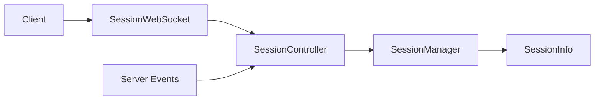

# Component: Emby.Server.Implementations — Session

**Path:** `Emby.Server.Implementations/Session/`
**Type:** Directory | Module
**Language:** C#
**Maps to:** `.discovery/215-emby-server-impl-session.md`

## Description

Client session management. Handles authentication sessions, session tracking, and real-time communication with clients.

## Files

- `SessionController.cs` — Emby.Server.Implementations/Session/SessionController.cs
- `SessionWebSocketListener.cs` — Emby.Server.Implementations/Session/SessionWebSocketListener.cs
- `SessionWebSocket.cs` — Emby.Server.Implementations/Session/SessionWebSocket.cs
- `WebSocketChannels.cs` — Emby.Server.Implementations/Session/WebSocketChannels.cs
- `WebSocketMessage.cs` — Emby.Server.Implementations/Session/WebSocketMessage.cs

## Decomposition

### SessionController.cs (Session Controller)

#### Imports
```csharp
using MediaBrowser.Controller.Net;
using MediaBrowser.Controller.Session;
using MediaBrowser.Model.Session;
using System;
using System.Collections.Generic;
using System.Threading.Tasks;
```

#### Classes
`SessionController` (public class : ISessionController)

#### Key Properties
| Property | Type | Description |
|----------|------|-------------|
| `Session` | `SessionInfo` | Current session |
| `ControllerType` | `SessionControllerType` | Controller type |

#### Key Methods
| Method | Return | Description |
|--------|--------|-------------|
| `SendMessage<T>(string, T)` | `Task` | Send message to client |
| `SendPlayCommand(PlayRequest)` | `Task` | Send playback command |
| `SendBrowseCommand(string)` | `Task` | Send browse command |
| `SendNotification(string, string, string)` | `Task` | Send notification |

### SessionWebSocket.cs (Session WebSocket)

#### Classes
`SessionWebSocket` (public class : IWebSocket, IDisposable)

#### Key Properties
| Property | Type | Description |
|----------|------|-------------|
| `State` | `WebSocketState` | Connection state |

#### Key Methods
| Method | Return | Description |
|--------|--------|-------------|
| `SendAsync(string)` | `Task` | Send text message |
| `CloseAsync()` | `Task` | Close connection |

### WebSocketMessage.cs (WebSocket Message)

#### Classes
`WebSocketMessage<T>` (public class)

#### Key Properties
| Property | Type | Description |
|----------|------|-------------|
| `MessageId` | `string` | Unique message ID |
| `MessageType` | `string` | Message type |
| `Data` | `T` | Message payload |

## Data Flow



## Dependencies

- `MediaBrowser.Controller.Net` — WebSocket interfaces
- `MediaBrowser.Model.Session` — Session models
- `WebSocketSharp` — WebSocket implementation

## Statistics

| Metric | Value |
|--------|-------|
| Files | 5 |
| Classes | 5 |
| LOC | ~350 |
