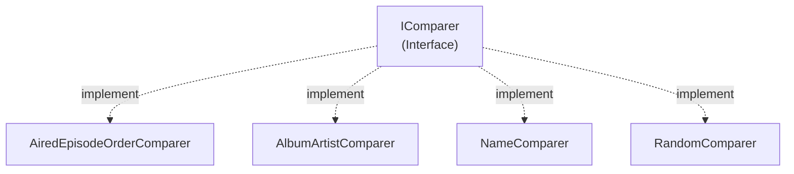

# Emby.Server.Implementations - Sorting Module

**Module:** Emby.Server.Implementations/Sorting
**Language:** C#
**Maps to:** `.discovery/216-emby-server-impl-sorting.md`

## Decomposition

The Sorting module contains 26 comparer classes implementing `IComparer<BaseItem>`:

#### Key Classes
- `AiredEpisodeOrderComparer` - Sort episodes by air date
- `AlbumArtistComparer` - Sort by album artist
- `AlbumComparer` - Sort albums
- `AlphanumComparator` - Alphanumeric sorting
- `ArtistComparer` - Sort by artist
- `CommunityRatingComparer` - Sort by community rating
- `CriticRatingComparer` - Sort by critic rating
- `DateCreatedComparer` - Sort by creation date
- `DateLastMediaAddedComparer` - Sort by last media addition
- `DatePlayedComparer` - Sort by play date
- `GameSystemComparer` - Sort by game system
- `IsFavoriteOrLikeComparer` - Favorites first
- `IsFolderComparer` - Folders first
- `IsPlayedComparer` - Unplayed first
- `IsUnplayedComparer` - Played first
- `NameComparer` - Sort by name
- `OfficialRatingComparer` - Sort by official rating
- `PlayCountComparer` - Sort by play count
- `PlayersComparer` - Sort by player count
- `PremiereDateComparer` - Sort by premiere date
- `ProductionYearComparer` - Sort by year
- `RandomComparer` - Random order
- `RuntimeComparer` - Sort by runtime
- `SeriesSortNameComparer` - Series sort name
- `SortNameComparer` - Sort by sort name
- `StartDateComparer` - Sort by start date
- `StudioComparer` - Sort by studio

## Architecture



## File Listing

```
Sorting/
├── AiredEpisodeOrderComparer.cs
├── AlbumArtistComparer.cs
├── AlbumComparer.cs
├── AlphanumComparator.cs
├── ArtistComparer.cs
├── CommunityRatingComparer.cs
├── CriticRatingComparer.cs
├── DateCreatedComparer.cs
├── DateLastMediaAddedComparer.cs
├── DatePlayedComparer.cs
├── GameSystemComparer.cs
├── IsFavoriteOrLikeComparer.cs
├── IsFolderComparer.cs
├── IsPlayedComparer.cs
├── IsUnplayedComparer.cs
├── NameComparer.cs
├── OfficialRatingComparer.cs
├── PlayCountComparer.cs
├── PlayersComparer.cs
├── PremiereDateComparer.cs
├── ProductionYearComparer.cs
├── RandomComparer.cs
├── RuntimeComparer.cs
├── SeriesSortNameComparer.cs
├── SortNameComparer.cs
├── StartDateComparer.cs
└── StudioComparer.cs
```

## Description

Sorting module provides all item comparers used for sorting media libraries. Each comparer implements IComparer<BaseItem> to sort items by different criteria.

## Dependencies

- **MediaBrowser.Controller.Entities** - BaseItem entity

## Statistics

- **Files:** 26
- **Lines:** ~500
- **Classes:** 26
