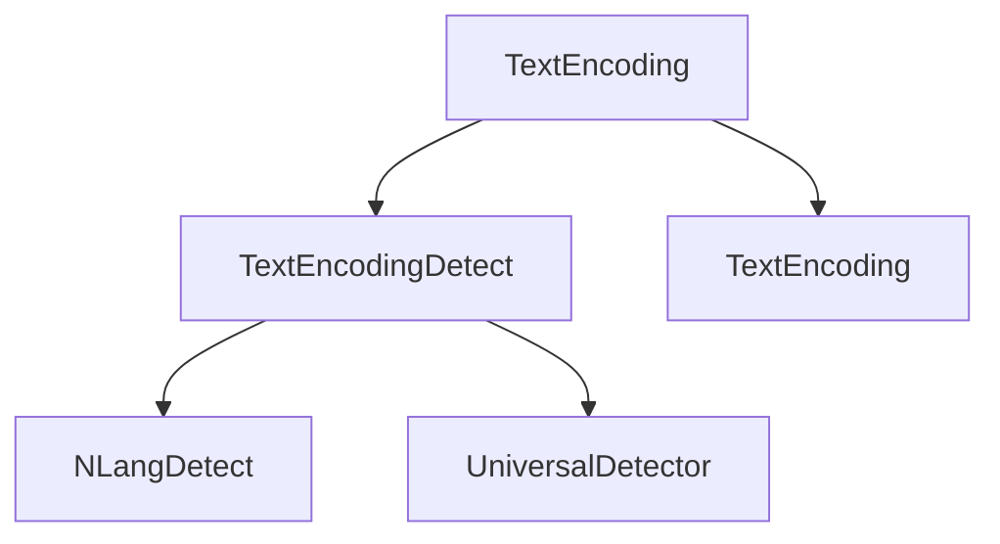

# Component: Emby.Server.Implementations.TextEncoding

**Path:** `Emby.Server.Implementations/TextEncoding/`
**Type:** Directory | Sub-Module
**Language:** C#
**Maps to:** `.discovery/216-emby-server-impl-textencoding.md`

## Description

Text encoding detection and language identification. Provides charset detection, language detection for filenames and content, and text encoding utilities.

## Directory Structure

```
Emby.Server.Implementations/TextEncoding/
├── NLangDetect/                  # NLanguage Detection port
├── UniversalDetector/            # Universal charset detection
├── TextEncoding.cs
└── TextEncodingDetect.cs
```

## Files

| File | Description |
|------|-------------|
| `TextEncoding.cs` | Text encoding utilities |
| `TextEncodingDetect.cs` | Charset detection |
| `NLangDetect/` | Language detection library |
| `UniversalDetector/` | Universal charset detector |

## Decomposition

### TextEncodingDetect.cs

#### Classes
`TextEncodingDetect` (public class)

#### Key Methods
| Method | Return | Description |
|--------|--------|-------------|
| `DetectCharset(byte[])` | `string` | Detect character set |
| `DetectLanguage(string)` | `string` | Detect language |

### TextEncoding.cs

#### Classes
`TextEncoding` (public static class)

#### Key Methods
| Method | Return | Description |
|--------|--------|-------------|
| `GetEncoding(string)` | `Encoding` | Get encoding by name |
| `Convert(Encoding, Encoding, byte[])` | `byte[]` | Convert between encodings |

## Architecture



## Dependencies

- System.Text — Encoding APIs
- System.Text.RegularExpressions — Regex for language patterns

## Statistics

| Metric | Value |
|--------|-------|
| C# Files | 3+ |
| LOC | ~25,000 |
| Public Classes | 5+ |
