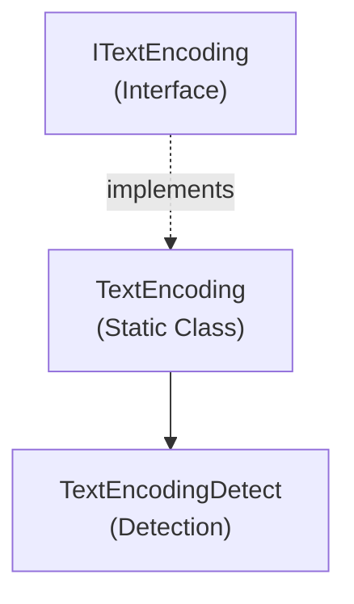

# Emby.Server.Implementations - TextEncoding Module

**Module:** Emby.Server.Implementations/TextEncoding
**Language:** C#
**Maps to:** `.discovery/217-emby-server-impl-textencoding.md`

## Decomposition

### TextEncoding.cs (Text Encoding Provider)

#### Imports
```csharp
using System.Text;
using MediaBrowser.Model.TextEncoding;
```

#### Classes
`TextEncoding` (public static class : ITextEncoding)

#### Key Methods
```csharp
Encoding GetEncoding(CharacterSet characterSet)
string GetCharacterSet(Encoding encoding)
```

### TextEncodingDetect.cs (Encoding Detection)

#### Classes
`TextEncodingDetect` (public static class)

### NLangDetect / UniversalDetector (Character Detection Libraries)

#### Classes
Character detection submodules

## Architecture



## File Listing

```
TextEncoding/
├── TextEncoding.cs        - Main text encoding provider
├── TextEncodingDetect.cs   - Encoding detection
├── NLangDetect/          - Language detection library
└── UniversalDetector/     - Universal charset detection
```

## Description

TextEncoding module provides text encoding and character set detection utilities. TextEncoding maps character sets to .NET Encoding objects. NLangDetect and UniversalDetector provide character encoding detection for media files.

## Dependencies

- **MediaBrowser.Model.TextEncoding** - Text encoding interfaces
- **System.Text** - .NET text encoding

## Statistics

- **Files:** 2 + subdirectories
- **Lines:** ~300
- **Classes:** 3+
