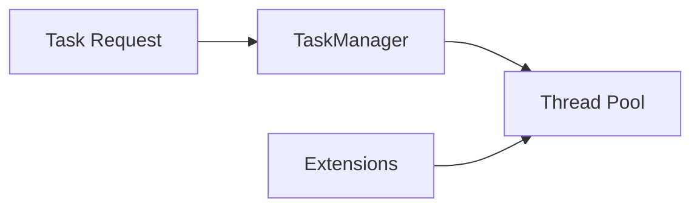

# Component: Emby.Server.Implementations — Threading

**Path:** `Emby.Server.Implementations/Threading/`
**Type:** Directory | Module
**Language:** C#
**Maps to:** `.discovery/217-emby-server-impl-threading.md`

## Description

Threading utilities and extensions. Provides parallel processing helpers and async extensions.

## Files

- `TaskManager.cs` — Emby.Server.Implementations/Threading/TaskManager.cs
- `ThreadingExtensions.cs` — Emby.Server.Implementations/Threading/ThreadingExtensions.cs

## Decomposition

### TaskManager.cs (Task Manager)

#### Imports
```csharp
using System;
using System.Collections.Generic;
using System.Threading;
using System.Threading.Tasks;
```

#### Classes
`TaskManager` (public static class)

#### Key Methods
| Method | Return | Description |
|--------|--------|-------------|
| `Start(Task, string)` | `void` | Start tracked task |
| `StartBackgroundTask(Func<Task>, string)` | `Task` | Start background task |
| `WaitAll(IEnumerable<Task>)` | `Task` | Wait for all tasks |
| `Delay(int, CancellationToken)` | `Task` | Delay execution |

### ThreadingExtensions.cs (Threading Extensions)

#### Classes
`ThreadingExtensions` (public static class)

#### Key Methods
| Method | Return | Description |
|--------|--------|-------------|
| `UsingSemaphore(int, Func<Task>)` | `Task` | Semaphore scope |
| `ParallelForEachAsync<T>(IEnumerable<T>, Func<T, Task>)` | `Task` | Parallel async foreach |
| `Run<T>(Func<T>)` | `T` | Run on thread pool |

## Data Flow



## Dependencies

- `System.Threading` — Threading primitives
- `System.Threading.Tasks` — Task parallelism

## Statistics

| Metric | Value |
|--------|-------|
| Files | 2 |
| Classes | 2 |
| LOC | ~100 |
