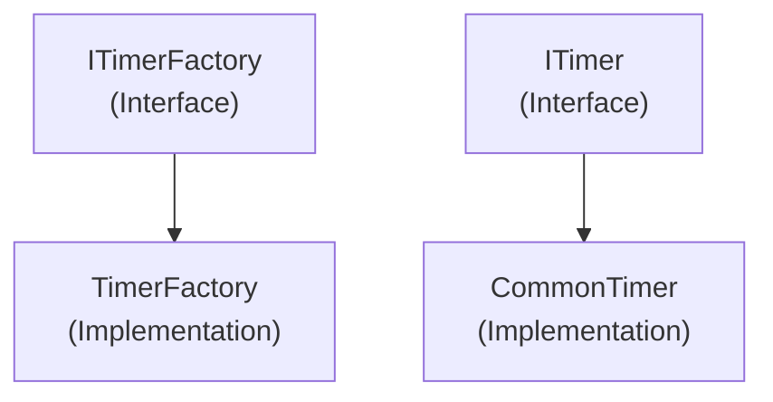

# Emby.Server.Implementations - Threading Module

**Module:** Emby.Server.Implementations/Threading
**Language:** C#
**Maps to:** `.discovery/218-emby-server-impl-threading.md`

## Decomposition

### TimerFactory.cs (Timer Factory)

#### Imports
```csharp
using System;
using System.Threading;
using System.Threading.Tasks;
using MediaBrowser.Model.Threading;
```

#### Classes
`TimerFactory` (public class : ITimerFactory)

#### Key Methods
```csharp
ITimer Create(TimerCallback callback, object state, TimeSpan dueTime, TimeSpan period)
```

### CommonTimer.cs (Common Timer Implementation)

#### Classes
`CommonTimer` (public class : ITimer)

#### Key Methods
```csharp
void Change(TimeSpan dueTime, TimeSpan period)
void Dispose()
```

## Architecture



## File Listing

```
Threading/
├── TimerFactory.cs - Timer factory implementation
└── CommonTimer.cs  - Common timer wrapper
```

## Description

Threading module provides threading utilities. TimerFactory creates timer instances. CommonTimer wraps System.Threading.Timer.

## Dependencies

- **MediaBrowser.Model.Threading** - Threading interfaces
- **System.Threading** - .NET threading

## Statistics

- **Files:** 2
- **Lines:** ~100
- **Classes:** 2
