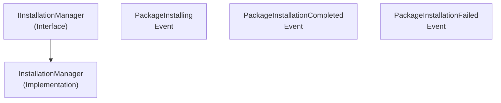

# Emby.Server.Implementations - Updates Module

**Module:** Emby.Server.Implementations/Updates
**Language:** C#
**Maps to:** `.discovery/219-emby-server-impl-updates.md`

## Decomposition

### InstallationManager.cs (Update/Installation Manager)

#### Imports
```csharp
using MediaBrowser.Common.Updates;
using MediaBrowser.Controller.Plugins;
using MediaBrowser.Model.Configuration;
using MediaBrowser.Model.Logging;
using MediaBrowser.Model.Updates;
using System;
using System.Collections.Generic;
using System.IO;
using System.Threading;
using System.Threading.Tasks;
```

#### Classes
`InstallationManager` (public class : IInstallationManager, IServerEntryPoint)

#### Key Properties
```csharp
IEnumerable<InstallationInfo> CompletedInstallations { get; }
```

#### Key Methods
```csharp
Task<IEnumerable<PackageVersionInfo>> GetAvailableUpdates(...)
Task<InstallationInfo> InstallPackage(...)
void CancelInstallation(Guid installationId)
event EventHandler<InstallationInfo> PackageInstalling
event EventHandler<InstallationInfo> PackageInstallationCompleted
event EventHandler<InstallationFailedEventArgs> PackageInstallationFailed
```

## Architecture



## File Listing

```
Updates/
└── InstallationManager.cs - Package update/installation management
```

## Description

Updates module manages Emby Server and plugin updates. InstallationManager handles checking for updates, downloading, and installing packages. It fires events during the installation process.

## Dependencies

- **MediaBrowser.Common.Updates** - Update interfaces
- **MediaBrowser.Model.Updates** - Update models
- **MediaBrowser.Controller.Plugins** - Plugin management

## Statistics

- **Files:** 1
- **Lines:** ~500
- **Classes:** 1
