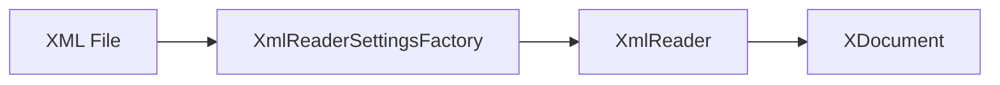

# Component: Emby.Server.Implementations — Xml

**Path:** `Emby.Server.Implementations/Xml/`
**Type:** Directory | Module
**Language:** C#
**Maps to:** `.discovery/219-emby-server-impl-xml.md`

## Description

XML configuration reading utilities. Provides XML-based configuration parsing.

## Files

- `XmlReaderSettingsFactory.cs` — Emby.Server.Implementations/Xml/XmlReaderSettingsFactory.cs

## Decomposition

### XmlReaderSettingsFactory.cs (XML Reader Settings Factory)

#### Imports
```csharp
using System.Xml;
using System.Xml.Linq;
using System.Xml.ReaderSettings;
```

#### Classes
`XmlReaderSettingsFactory` (public static class)

#### Key Methods
| Method | Return | Description |
|--------|--------|-------------|
| `CreateSettings()` | `XmlReaderSettings` | Create reader settings |
| `CreateConformanceLevel()` | `ConformanceLevel` | Get conformance level |

## Data Flow



## Dependencies

- `System.Xml` — XML parsing
- `System.Xml.Linq` — LINQ to XML

## Statistics

| Metric | Value |
|--------|-------|
| Files | 1 |
| Classes | 1 |
| LOC | ~20 |
