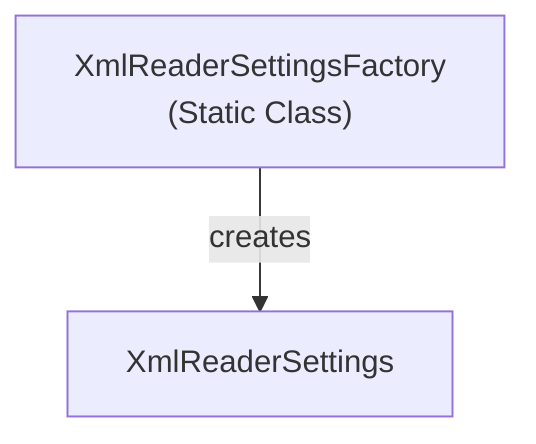

# Emby.Server.Implementations - Xml Module

**Module:** Emby.Server.Implementations/Xml
**Language:** C#
**Maps to:** `.discovery/220-emby-server-impl-xml.md`

## Decomposition

### XmlReaderSettingsFactory.cs (XML Reader Settings Factory)

#### Imports
```csharp
using System.Xml;
```

#### Classes
`XmlReaderSettingsFactory` (public static class)

#### Key Methods
```csharp
XmlReaderSettings CreateSettings()
```

## Architecture



## File Listing

```
Xml/
└── XmlReaderSettingsFactory.cs - XML reader settings factory
```

## Description

Xml module provides XML reader settings for consistent XML parsing across the application.

## Dependencies

- **System.Xml** - XML APIs

## Statistics

- **Files:** 1
- **Lines:** ~50
- **Classes:** 1
