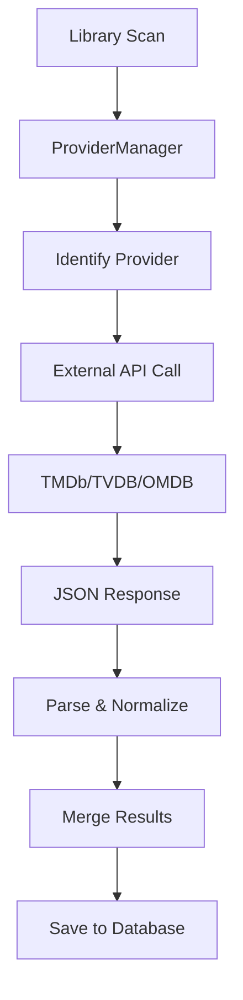

# Component: MediaBrowser.Providers

**Path:** `MediaBrowser.Providers/`
**Type:** Directory | Module
**Language:** C#
**Maps to:** `.discovery/220-mediabrowser-providers.md`

## Description

MediaBrowser.Providers contains metadata provider implementations for fetching media information from external sources. It includes providers for movies, TV shows, music, photos, and people from services like OMDB, as well as local metadata parsers. The `ProviderManager` coordinates provider execution and result merging.

## Structure

```
MediaBrowser.Providers/
├── Manager/
│   └── ProviderManager.cs       # Coordinates all providers → [class] ProviderManager
├── Movies/                      # Movie metadata providers
│   ├── MovieDbProvider.cs       # TheMovieDB (TMDb)
│   └── ...
├── TV/                          # TV show metadata providers
│   ├── TvdbProvider.cs          # TheTVDB
│   └── ...
├── Music/                       # Music metadata providers
│   ├── AudioDbProvider.cs       # TheAudioDB
│   └── ...
├── Omdb/                        # OMDB (Open Movie Database)
│   └── OmdbProvider.cs
├── People/                      # People/actor metadata
├── Photos/                      # Photo metadata
├── Videos/                      # Video file metadata
├── MediaInfo/                   # MediaInfo library integration
│   └── MediaInfoProvider.cs     # Technical stream info
├── Subtitles/                   # Subtitle providers
├── Chapters/                    # Chapter metadata
├── LiveTv/                      # Live TV program info
├── Books/                       # Book/ebook metadata
├── Games/                       # Game metadata
├── GameGenres/                  # Game genre providers
├── Genres/                      # Genre providers
├── MusicGenres/               # Music genre providers
├── Studios/                     # Studio metadata
├── Years/                       # Year-based organization
├── Users/                       # User data providers
├── BoxSets/                     # Box set/collection providers
├── Folders/                     # Folder metadata
├── Channels/                    # Channel content providers
└── Properties/                  # Assembly info
```

## Key Classes

| Class | File | Purpose |
|-------|------|---------|
| `ProviderManager` | `Manager/ProviderManager.cs` | Coordinates provider execution |
| `MovieDbProvider` | `Movies/MovieDbProvider.cs` | TheMovieDB (TMDb) integration |
| `TvdbProvider` | `TV/TvdbProvider.cs` | TheTVDB integration |
| `OmdbProvider` | `Omdb/OmdbProvider.cs` | OMDB integration |
| `MediaInfoProvider` | `MediaInfo/MediaInfoProvider.cs` | Technical media info |

## Data Flow



## Dependencies

- `MediaBrowser.Controller` — Provider interfaces
- `MediaBrowser.Model` — Model types
- `Emby.Server.Implementations` — Server services
- External APIs: TMDb, TVDB, OMDB, TheAudioDB

## Side Effects

- Makes HTTP requests to external APIs
- Writes metadata images to cache
- Updates database records
- Respects API rate limits

## Reference

- Provider interfaces: `IMetadataProvider`, `IImageProvider` in `MediaBrowser.Controller`
