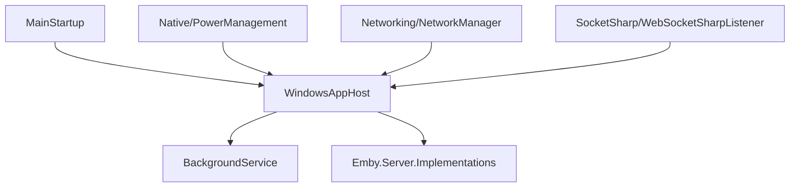

# Component: MediaBrowser.ServerApplication — Expanded

**Path:** `MediaBrowser.ServerApplication/`
**Type:** Directory | Application
**Language:** C#
**Maps to:** `.discovery/221-mediabrowser-serverapplication-internals.md`

## Description

Windows-specific server application. Contains the main entry point, Windows service integration, networking, and platform-specific native code.

## Files

### Root Files (14 files)

- `App.config` — MediaBrowser.ServerApplication/App.config
- `ApplicationPathHelper.cs` — MediaBrowser.ServerApplication/ApplicationPathHelper.cs
- `BackgroundService.cs` — MediaBrowser.ServerApplication/BackgroundService.cs
- `BackgroundServiceInstaller.cs` — MediaBrowser.ServerApplication/BackgroundServiceInstaller.cs
- `Icon.ico` — MediaBrowser.ServerApplication/Icon.ico
- `ImageEncoderHelper.cs` — MediaBrowser.ServerApplication/ImageEncoderHelper.cs
- `MainStartup.cs` — MediaBrowser.ServerApplication/MainStartup.cs
- `MediaBrowser.ServerApplication.csproj` — MediaBrowser.ServerApplication/MediaBrowser.ServerApplication.csproj
- `ServerNotifyIcon.cs` — MediaBrowser.ServerApplication/ServerNotifyIcon.cs
- `app.manifest` — MediaBrowser.ServerApplication/app.manifest
- `packages.config` — MediaBrowser.ServerApplication/packages.config
- `SplashLogo2.png` — MediaBrowser.ServerApplication/SplashLogo2.png

### Native/ (6 files)

- `LnkShortcutHandler.cs` — MediaBrowser.ServerApplication/Native/LnkShortcutHandler.cs
- `LoopUtil.cs` — MediaBrowser.ServerApplication/Native/LoopUtil.cs
- `PowerManagement.cs` — MediaBrowser.ServerApplication/Native/PowerManagement.cs
- `RegisterServer.bat` — MediaBrowser.ServerApplication/Native/RegisterServer.bat
- `ServerAuthorization.cs` — MediaBrowser.ServerApplication/Native/ServerAuthorization.cs
- `Standby.cs` — MediaBrowser.ServerApplication/Native/Standby.cs

### Networking/ (3 files)

- `NativeMethods.cs` — MediaBrowser.ServerApplication/Networking/NativeMethods.cs
- `NetworkManager.cs` — MediaBrowser.ServerApplication/Networking/NetworkManager.cs
- `NetworkShares.cs` — MediaBrowser.ServerApplication/Networking/NetworkShares.cs

### Properties/ (3 files)

- `AssemblyInfo.cs` — MediaBrowser.ServerApplication/Properties/AssemblyInfo.cs
- `Resources.Designer.cs` — MediaBrowser.ServerApplication/Properties/Resources.Designer.cs
- `Resources.resx` — MediaBrowser.ServerApplication/Properties/Resources.resx

### Resources/Images/ (1 file)

- `Images/mb3logo800.png` — MediaBrowser.ServerApplication/Resources/Images/mb3logo800.png

### SocketSharp/ (5 files)

- `RequestMono.cs` — MediaBrowser.ServerApplication/SocketSharp/RequestMono.cs
- `SharpWebSocket.cs` — MediaBrowser.ServerApplication/SocketSharp/SharpWebSocket.cs
- `WebSocketSharpListener.cs` — MediaBrowser.ServerApplication/SocketSharp/WebSocketSharpListener.cs
- `WebSocketSharpRequest.cs` — MediaBrowser.ServerApplication/SocketSharp/WebSocketSharpRequest.cs
- `WebSocketSharpResponse.cs` — MediaBrowser.ServerApplication/SocketSharp/WebSocketSharpResponse.cs

### Splash/ (3 files)

- `SplashForm.Designer.cs` — MediaBrowser.ServerApplication/Splash/SplashForm.Designer.cs
- `SplashForm.cs` — MediaBrowser.ServerApplication/Splash/SplashForm.cs
- `SplashForm.resx` — MediaBrowser.ServerApplication/Splash/SplashForm.resx

### Updates/ (1 file)

- `ApplicationUpdater.cs` — MediaBrowser.ServerApplication/Updates/ApplicationUpdater.cs

### Windows-specific (1 file)

- `WindowsAppHost.cs` — MediaBrowser.ServerApplication/WindowsAppHost.cs

### Native Binaries (3 files)

- `x64/sqlite3.dll` — MediaBrowser.ServerApplication/x64/sqlite3.dll
- `x86/sqlite3.dll` — MediaBrowser.ServerApplication/x86/sqlite3.dll

## Architecture

## Key Classes

| Class | Responsibility |
|-------|----------------|
| `WindowsAppHost` | Windows application host |
| `MainStartup` | Entry point |
| `BackgroundService` | Windows service integration |
| `NetworkManager` | Network interface management |
| `NetworkShares` | SMB share enumeration |
| `ApplicationUpdater` | Auto-update handling |

## Dependencies

- Emby.Server.Implementations
- MediaBrowser.Model
- SocketHttpListener
