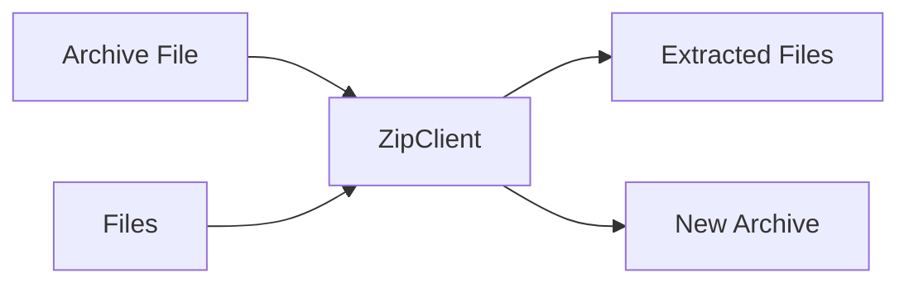

# Component: Emby.Server.Implementations — Archiving

**Path:** `Emby.Server.Implementations/Archiving/`
**Type:** Directory | Module
**Language:** C#
**Maps to:** `.discovery/223-emby-server-impl-archiving.md`

## Description

Archive extraction and creation utilities. Handles ZIP archive operations for package installations and backups.

## Files

- `ZipClient.cs` — Emby.Server.Implementations/Archiving/ZipClient.cs

## Decomposition

### ZipClient.cs (ZIP Client)

#### Imports
```csharp
using MediaBrowser.Model.IO;
using System;
using System.Collections.Generic;
using System.IO;
using System.Threading.Tasks;
using ICSharpCode.SharpZipLib.Zip;
```

#### Classes
`ZipClient` (public class : IZipClient)

#### Key Methods
| Method | Return | Description |
|--------|--------|-------------|
| `Extract(string, string)` | `Task` | Extract ZIP archive |
| `Extract(Stream, string)` | `Task` | Extract from stream |
| `Compress(string, IEnumerable<string>)` | `Task<string>` | Create ZIP archive |
| `GetEntries(string)` | `IEnumerable<ZipEntry>` | List archive entries |

## Data Flow



## Dependencies

- `SharpZipLib` — ZIP library
- `MediaBrowser.Model.IO` — IO interfaces

## Statistics

| Metric | Value |
|--------|-------|
| Files | 1 |
| Classes | 1 |
| LOC | ~80 |
