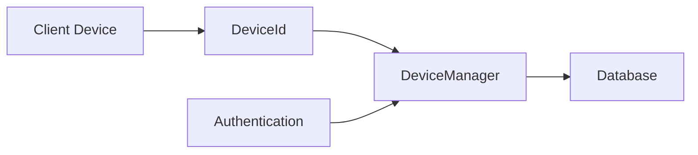

# Component: Emby.Server.Implementations — Devices

**Path:** `Emby.Server.Implementations/Devices/`
**Type:** Directory | Module
**Language:** C#
**Maps to:** `.discovery/226-emby-server-impl-devices.md`

## Description

Device identification and management. Handles device registration, authentication, and capability tracking.

## Files

- `DeviceId.cs` — Emby.Server.Implementations/Devices/DeviceId.cs
- `DeviceManager.cs` — Emby.Server.Implementations/Devices/DeviceManager.cs

## Decomposition

### DeviceId.cs (Device Identifier)

#### Imports
```csharp
using MediaBrowser.Model.Devices;
using System;

public class DeviceId
```

#### Classes
`DeviceId` (public class)

#### Key Properties
| Property | Type | Description |
|----------|------|-------------|
| `DeviceId` | `string` | Unique device ID |
| `DeviceName` | `string` | Human-readable name |

### DeviceManager.cs (Device Manager)

#### Classes
`DeviceManager` (public class : IDeviceManager)

#### Key Properties
| Property | Type | Description |
|----------|------|-------------|
| `Devices` | `IEnumerable<DeviceInfo>` | Registered devices |

#### Key Methods
| Method | Return | Description |
|--------|--------|-------------|
| `GetDevice(string)` | `DeviceInfo` | Get device by ID |
| `RegisterDevice(DeviceInfo)` | `Task` | Register new device |
| `UpdateDevice(DeviceInfo)` | `Task` | Update device info |
| `ValidateDevice(string, string)` | `bool` | Validate device token |

## Data Flow



## Dependencies

- `MediaBrowser.Model.Devices` — Device models

## Statistics

| Metric | Value |
|--------|-------|
| Files | 2 |
| Classes | 2 |
| LOC | ~100 |
