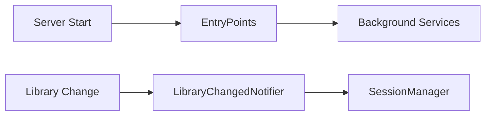

# Component: Emby.Server.Implementations — EntryPoints

**Path:** `Emby.Server.Implementations/EntryPoints/`
**Type:** Directory | Module
**Language:** C#
**Maps to:** `.discovery/227-emby-server-impl-entrypoints.md`

## Description

Server lifecycle entry points. Contains background services that run during server startup, shutdown, and runtime events.

## Files

- `AutomaticRestartEntryPoint.cs` — Emby.Server.Implementations/EntryPoints/AutomaticRestartEntryPoint.cs
- `ExternalPortForwarding.cs` — Emby.Server.Implementations/EntryPoints/ExternalPortForwarding.cs
- `KeepServerAwake.cs` — Emby.Server.Implementations/EntryPoints/KeepServerAwake.cs
- `LibraryChangedNotifier.cs` — Emby.Server.Implementations/EntryPoints/LibraryChangedNotifier.cs
- `RecordingNotifier.cs` — Emby.Server.Implementations/EntryPoints/RecordingNotifier.cs
- `RefreshUsersMetadata.cs` — Emby.Server.Implementations/EntryPoints/RefreshUsersMetadata.cs
- `ServerEventNotifier.cs` — Emby.Server.Implementations/EntryPoints/ServerEventNotifier.cs
- `StartupWizard.cs` — Emby.Server.Implementations/EntryPoints/StartupWizard.cs
- `SystemEvents.cs` — Emby.Server.Implementations/EntryPoints/SystemEvents.cs
- `UdpServerEntryPoint.cs` — Emby.Server.Implementations/EntryPoints/UdpServerEntryPoint.cs
- `UsageEntryPoint.cs` — Emby.Server.Implementations/EntryPoints/UsageEntryPoint.cs
- `UsageReporter.cs` — Emby.Server.Implementations/EntryPoints/UsageReporter.cs
- `UserDataChangeNotifier.cs` — Emby.Server.Implementations/EntryPoints/UserDataChangeNotifier.cs

## Decomposition

### StartupWizard.cs (Startup Wizard)

#### Imports
```csharp
using MediaBrowser.Controller.Configuration;
using MediaBrowser.Controller.Library;
using System;
using System.Threading.Tasks;
```

#### Classes
`StartupWizard` (public class : IRunAtStartup)

#### Key Methods
| Method | Return | Description |
|--------|--------|-------------|
| `Run()` | `Task` | Run startup tasks |

### LibraryChangedNotifier.cs (Library Change Notifier)

#### Classes
`LibraryChangedNotifier` (public class : IRunAfterLibraryAddedChangedDeleted)

#### Key Methods
| Method | Return | Description |
|--------|--------|-------------|
| `OnItemAdded(ItemChangeEventArgs)` | `Task` | Handle item added |
| `OnItemChanged(ItemChangeEventArgs)` | `Task` | Handle item changed |
| `OnItemRemoved(ItemChangeEventArgs)` | `Task` | Handle item removed |

### ExternalPortForwarding.cs (Port Forwarding)

#### Classes
`ExternalPortForwarding` (public class : IRunAtStartup, IDisposable)

#### Key Methods
| Method | Return | Description |
|--------|--------|-------------|
| `OpenPort(int, string)` | `Task` | Open port |
| `ClosePort(int)` | `void` | Close port |

## Data Flow



## Dependencies

- `MediaBrowser.Controller.Library` — Library interfaces
- `Mono.Nat` — NAT traversal

## Statistics

| Metric | Value |
|--------|-------|
| Files | 13 |
| Classes | 13 |
| LOC | ~500 |
