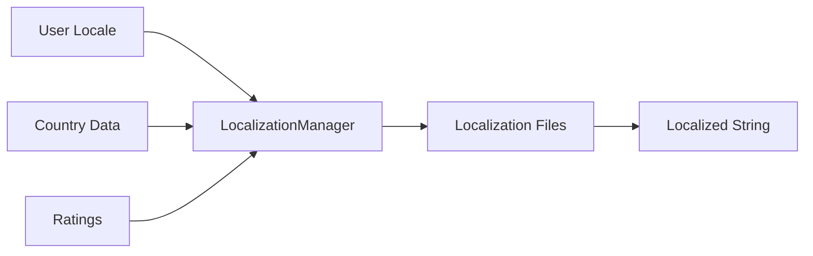

# Component: Emby.Server.Implementations — Localization

**Path:** `Emby.Server.Implementations/Localization/`
**Type:** Directory | Module
**Language:** C#
**Maps to:** `.discovery/228-emby-server-impl-localization.md`

## Description

Internationalization and localization support. Provides multi-language strings, country data, and text localization.

## Directory Structure

```
Localization/
├── Core/
│   └── (localization files)
├── Ratings/
│   └── (rating files)
├── countries.json
├── iso6392.txt
├── LocalizationManager.cs
└── TextLocalizer.cs
```

## Files

- `LocalizationManager.cs` — Emby.Server.Implementations/Localization/LocalizationManager.cs
- `TextLocalizer.cs` — Emby.Server.Implementations/Localization/TextLocalizer.cs
- `countries.json` — Country data
- `iso6392.txt` — ISO 639-2 language codes

## Decomposition

### LocalizationManager.cs (Localization Manager)

#### Imports
```csharp
using MediaBrowser.Model.Globalization;
using System;
using System.Collections.Generic;
using System.Globalization;
```

#### Classes
`LocalizationManager` (public class : ILocalizationManager)

#### Key Properties
| Property | Type | Description |
|----------|------|-------------|
| `CurrentCulture` | `CultureInfo` | Active culture |
| `Cultures` | `IEnumerable<CultureDto>` | Available cultures |

#### Key Methods
| Method | Return | Description |
|--------|--------|-------------|
| `GetLocalizedString(string)` | `string` | Get string |
| `GetCultures()` | `IEnumerable<CultureDto>` | List cultures |
| `GetCountries()` | `IEnumerable<CountryInfo>` | List countries |
| `GetParentalRatings()` | `IEnumerable<ParentalRating>` | Get ratings |

### TextLocalizer.cs (Text Localizer)

#### Classes
`TextLocalizer` (public interface)

#### Key Methods
| Method | Return | Description |
|--------|--------|-------------|
| `GetString(string, string[])` | `string` | Get localized string |

## Data Flow



## Dependencies

- `MediaBrowser.Model.Globalization` — Localization models
- `System.Globalization` — .NET localization

## Statistics

| Metric | Value |
|--------|-------|
| Files | 2 + JSON + subdirs |
| Classes | 2 |
| LOC | ~200 |
