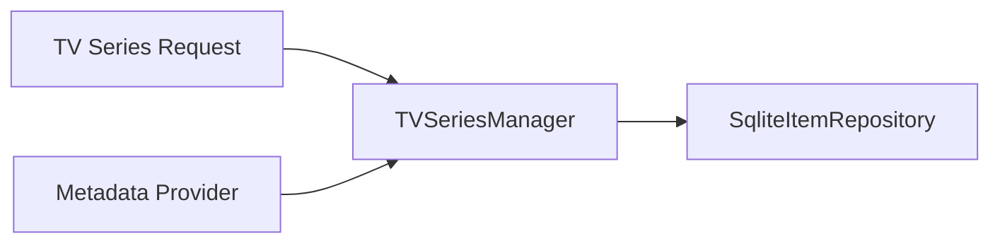

# Component: Emby.Server.Implementations — TV

**Path:** `Emby.Server.Implementations/TV/`
**Type:** Directory | Module
**Language:** C#
**Maps to:** `.discovery/229-emby-server-impl-tv.md`

## Description

TV series management and organization. Handles series metadata, episode grouping, and TV-specific functionality.

## Files

- `TVSeriesManager.cs` — Emby.Server.Implementations/TV/TVSeriesManager.cs

## Decomposition

### TVSeriesManager.cs (TV Series Manager)

#### Imports
```csharp
using MediaBrowser.Controller.Entities;
using MediaBrowser.Controller.Library;
using MediaBrowser.Model.Entities;
using System;
using System.Collections.Generic;
using System.Threading.Tasks;
```

#### Classes
`TVSeriesManager` (public class)

#### Key Properties
| Property | Type | Description |
|----------|------|-------------|
| `Series` | `IEnumerable<Series>` | All TV series |

#### Key Methods
| Method | Return | Description |
|--------|--------|-------------|
| `GetNextUp(NextUpQuery)` | `Task<IEnumerable<BaseItem>>` | Get next up items |
| `GetSeasonEpisodes(Season)` | `IEnumerable<Episode>` | Get season episodes |
| `RefreshSeriesMetadata(Series, MetadataRefreshOptions)` | `Task` | Refresh metadata |

## Data Flow



## Dependencies

- `MediaBrowser.Controller.Entities` — Series, Episode types
- `MediaBrowser.Controller.Library` — Library interfaces

## Statistics

| Metric | Value |
|--------|-------|
| Files | 1 |
| Classes | 1 |
| LOC | ~100 |
