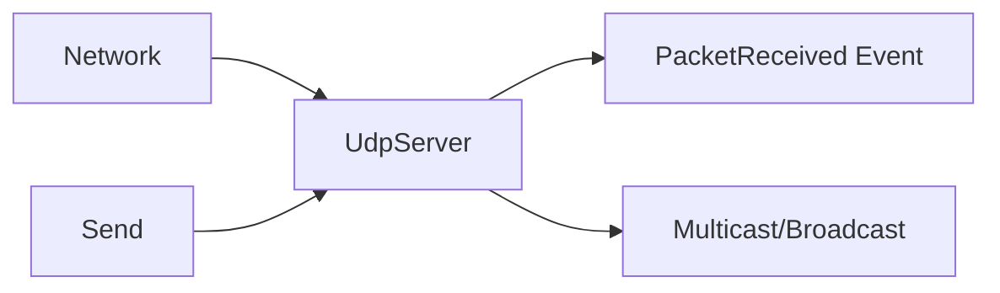

# Component: Emby.Server.Implementations — Udp

**Path:** `Emby.Server.Implementations/Udp/`
**Type:** Directory | Module
**Language:** C#
**Maps to:** `.discovery/230-emby-server-impl-udp.md`

## Description

UDP server implementation for network discovery and multicast communication. Used for DLNA/UPnP discovery protocols.

## Files

- `UdpServer.cs` — Emby.Server.Implementations/Udp/UdpServer.cs

## Decomposition

### UdpServer.cs (UDP Server)

#### Imports
```csharp
using MediaBrowser.Model.Net;
using System;
using System.Net;
using System.Net.Sockets;
using System.Text;
using System.Threading.Tasks;
```

#### Classes
`UdpServer` (public class : IDisposable)

#### Key Properties
| Property | Type | Description |
|----------|------|-------------|
| `Port` | `int` | Listening port |
| `IsListening` | `bool` | Server state |

#### Key Methods
| Method | Return | Description |
|--------|--------|-------------|
| `Start(int)` | `void` | Start server |
| `Stop()` | `void` | Stop server |
| `Send(IPEndPoint, string)` | `Task` | Send message |
| `Broadcast(string, int)` | `Task` | Broadcast message |

#### Key Events
| Event | Description |
|-------|-------------|
| `PacketReceived` | Data received |

## Data Flow



## Dependencies

- `System.Net.Sockets` — UDP socket

## Statistics

| Metric | Value |
|--------|-------|
| Files | 1 |
| Classes | 1 |
| LOC | ~100 |
