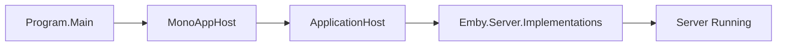

# Component: MediaBrowser.Server.Mono

**Path:** `MediaBrowser.Server.Mono/`
**Type:** Directory | Application
**Language:** C#
**Maps to:** `.discovery/230-mediabrowser-server-mono.md`

## Description

MediaBrowser.Server.Mono is the Mono/Linux entry point for Emby Server. It provides a console application that bootstraps the server on Mono runtime environments, handling Unix-specific concerns like signal handling, daemonization, and file path conventions.

## Structure

```
MediaBrowser.Server.Mono/
├── MediaBrowser.Server.Mono.csproj
├── Program.cs                   # Mono entry point → [class] Program
├── MonoAppHost.cs               # Mono-specific app host
└── Properties/                  # Assembly info
```

## Key Classes

| Class | File | Purpose |
|-------|------|---------|
| `Program` | `Program.cs` | Main entry point for Mono |
| `MonoAppHost` | `MonoAppHost.cs` | Mono-specific host configuration |

## Data Flow



## Dependencies

- `Emby.Server.Implementations` — Core server
- `MediaBrowser.Controller` — Controller interfaces

## Side Effects

- Starts server process on Mono
- Handles Unix signals (SIGTERM, SIGHUP)

## Reference

- Mono runtime: `https://www.mono-project.com/`
