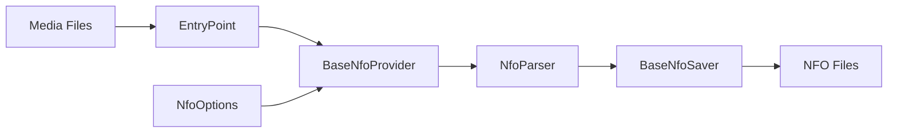

# Component: MediaBrowser.XbmcMetadata — Expanded

**Path:** `MediaBrowser.XbmcMetadata/`
**Type:** Directory | Module
**Language:** C#
**Maps to:** `.discovery/241-mediabrowser-xbmcmetadata-internals.md`

## Description

XBMC/Kodi-compatible metadata provider. Reads and writes NFO files in XBMC/Kodi format for movies, TV shows, music, and other media types.

## Files

### Root Files

- `EntryPoint.cs` — MediaBrowser.XbmcMetadata/EntryPoint.cs

### Configuration/ (1 file)

- `NfoOptions.cs` — MediaBrowser.XbmcMetadata/Configuration/NfoOptions.cs

### Parsers/ (5 files)

- `BaseNfoParser.cs` — MediaBrowser.XbmcMetadata/Parsers/BaseNfoParser.cs
- `EpisodeNfoParser.cs` — MediaBrowser.XbmcMetadata/Parsers/EpisodeNfoParser.cs
- `MovieNfoParser.cs` — MediaBrowser.XbmcMetadata/Parsers/MovieNfoParser.cs
- `SeasonNfoParser.cs` — MediaBrowser.XbmcMetadata/Parsers/SeasonNfoParser.cs
- `SeriesNfoParser.cs` — MediaBrowser.XbmcMetadata/Parsers/SeriesNfoParser.cs

### Providers/ (8 files)

- `AlbumNfoProvider.cs` — MediaBrowser.XbmcMetadata/Providers/AlbumNfoProvider.cs
- `ArtistNfoProvider.cs` — MediaBrowser.XbmcMetadata/Providers/ArtistNfoProvider.cs
- `BaseNfoProvider.cs` — MediaBrowser.XbmcMetadata/Providers/BaseNfoProvider.cs
- `BaseVideoNfoProvider.cs` — MediaBrowser.XbmcMetadata/Providers/BaseVideoNfoProvider.cs
- `EpisodeNfoProvider.cs` — MediaBrowser.XbmcMetadata/Providers/EpisodeNfoProvider.cs
- `MovieNfoProvider.cs` — MediaBrowser.XbmcMetadata/Providers/MovieNfoProvider.cs
- `SeasonNfoProvider.cs` — MediaBrowser.XbmcMetadata/Providers/SeasonNfoProvider.cs
- `SeriesNfoProvider.cs` — MediaBrowser.XbmcMetadata/Providers/SeriesNfoProvider.cs

### Savers/ (7 files)

- `AlbumNfoSaver.cs` — MediaBrowser.XbmcMetadata/Savers/AlbumNfoSaver.cs
- `ArtistNfoSaver.cs` — MediaBrowser.XbmcMetadata/Savers/ArtistNfoSaver.cs
- `BaseNfoSaver.cs` — MediaBrowser.XbmcMetadata/Savers/BaseNfoSaver.cs
- `EpisodeNfoSaver.cs` — MediaBrowser.XbmcMetadata/Savers/EpisodeNfoSaver.cs
- `MovieNfoSaver.cs` — MediaBrowser.XbmcMetadata/Savers/MovieNfoSaver.cs
- `SeasonNfoSaver.cs` — MediaBrowser.XbmcMetadata/Savers/SeasonNfoSaver.cs
- `SeriesNfoSaver.cs` — MediaBrowser.XbmcMetadata/Savers/SeriesNfoSaver.cs

### Properties/ (1 file)

- `AssemblyInfo.cs` — MediaBrowser.XbmcMetadata/Properties/AssemblyInfo.cs

## Data Flow

## Supported Media Types

| Type | Provider | Parser | Saver |
|------|----------|--------|-------|
| Movie | MovieNfoProvider | MovieNfoParser | MovieNfoSaver |
| Episode | EpisodeNfoProvider | EpisodeNfoParser | EpisodeNfoSaver |
| Season | SeasonNfoProvider | SeasonNfoParser | SeasonNfoSaver |
| Series | SeriesNfoProvider | SeriesNfoParser | SeriesNfoSaver |
| Album | AlbumNfoProvider | - | AlbumNfoSaver |
| Artist | ArtistNfoProvider | - | ArtistNfoSaver |

## NFO Format Compatibility

- Compatible with XBMC/Kodi NFO format
- Supports TMDB, TVDB, IMDB external ID tags
- Embedded artwork support

## Dependencies

- `MediaBrowser.Controller` — Base entity types
- `MediaBrowser.Model` — API models
