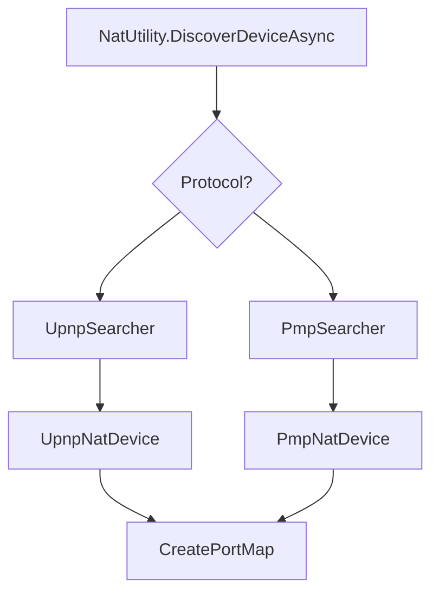

# Component: Mono.Nat — Internals

**Path:** `Mono.Nat/`
**Type:** Module
**Language:** C#
**Maps to:** `.discovery/251-mono-nat-internals.md`
**Parent:** `.discovery/250-mono-nat.md`

## Description

Network Address Translation (NAT) traversal library. Provides UPnP and PMP
port mapping functionality for opening ports through routers.

## Structure

```
Mono.Nat/
├── NatUtility.cs                 # [class] NatUtility
│   ├── Entry point for NAT discovery
│   ├── Discovers NAT devices
│   └── Creates port mappings
├── AbstractNatDevice.cs          # [class] AbstractNatDevice
│   └── Base NAT device class
├── INatDevice.cs                 # [interface] INatDevice
│   └── NAT device interface
├── Mapping.cs                    # [class] Mapping
│   └── Port mapping definition
├── NatProtocol.cs                # [enum] NatProtocol
│   └── UPnP / PMP protocols
├── Upnp/
│   ├── UpnpNatDevice.cs          # [class] UpnpNatDevice
│   │   └── UPnP NAT device
│   ├── UpnpSearcher.cs           # [class] UpnpSearcher
│   │   └── UPnP device discovery
│   └── *Upnp*.cs                 # UPnP helpers
└── Pmp/
    ├── PmpNatDevice.cs           # [class] PmpNatDevice
    │   └── PMP NAT device
    ├── PmpSearcher.cs            # [class] PmpSearcher
    │   └── PMP device discovery
    └── *Pmp*.cs                  # PMP helpers
```

## Key Classes

| Class | File | Purpose |
|-------|------|---------|
| `NatUtility` | `NatUtility.cs` | NAT entry point |
| `UpnpNatDevice` | `Upnp/UpnpNatDevice.cs` | UPnP device |
| `PmpNatDevice` | `Pmp/PmpNatDevice.cs` | PMP device |
| `Mapping` | `Mapping.cs` | Port mapping |

## NAT Traversal Flow


