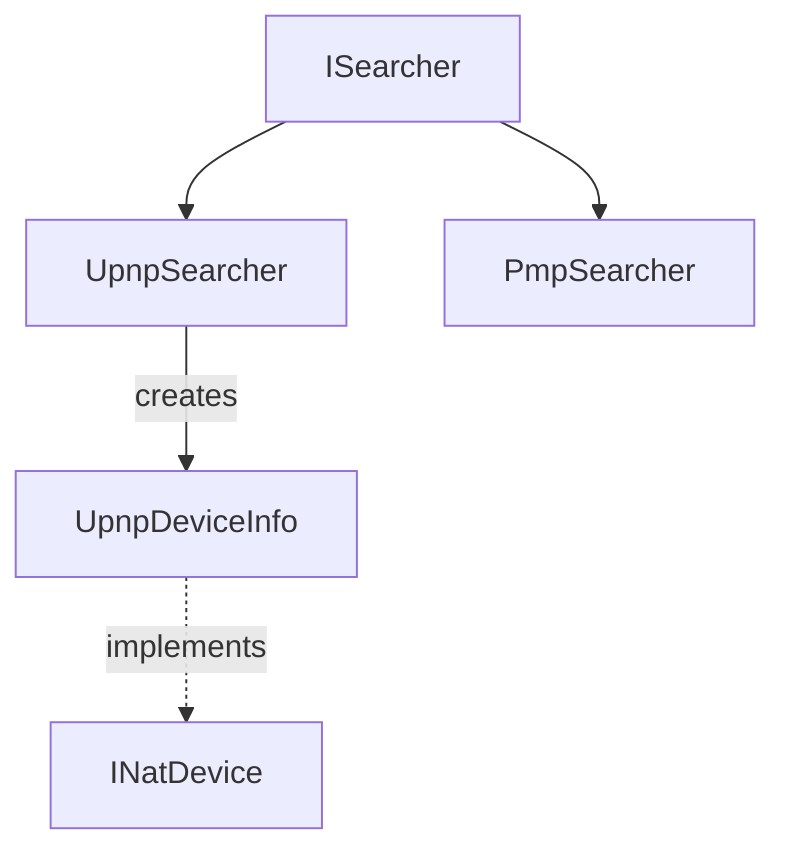

# Mono.Nat - Network Address Translation

**Module:** Mono.Nat
**Language:** C#
**Maps to:** `.discovery/252-mono-nat-internals.md`

## Decomposition

### Upnp/ (UPnP Discovery)

#### Key Classes
`UpnpSearcher` (public class : ISearcher)
`UpnpDeviceInfo` (public class)

#### Key Methods
```csharp
IEnumerable<NatDevice> Search()
Task<IEnumerable<NatDevice>> SearchAsync()
void CreatePortMap(Mapping mapping)
void DeletePortMap(Mapping mapping)
```

#### Key Events
```csharp
event EventHandler<Device_FOUND> DeviceFound
```

### Pmp/ (NAT-PMP Discovery)

#### Key Classes
`PmpSearcher` (public class : ISearcher)
`PmpClient` (public class)

#### Key Methods
```csharp
IEnumerable<NatDevice> Discover()
Task<NatDevice> DiscoverAsync()
```

### Enums/ (Enumerations)

#### Enumerations
`Protocol` (public enum : TCP, UDP)
`SearchStatus` (public enum)

### EventArgs/ (Event Arguments)

#### Classes
`DeviceEventArgs` (public class : EventArgs)
`DeviceFoundEventArgs` (public class : EventArgs)
`PortMappingEventArgs` (public class : EventArgs)

## Architecture



## File Listing

```
Mono.Nat/
├── Upnp/
│   ├── UpnpSearcher.cs         - UPnP discovery
│   ├── UpnpDeviceInfo.cs       - UPnP device
│   └── [Other UPnP files]
├── Pmp/
│   ├── PmpSearcher.cs          - NAT-PMP discovery
│   ├── PmpClient.cs             - NAT-PMP client
│   └── [Other NAT-PMP files]
├── Enums/
│   └── [Enumerations]
├── EventArgs/
│   └── [Event argument classes]
└── Properties/
    └── AssemblyInfo.cs
```

## Description

Mono.Nat provides NAT traversal functionality using UPnP and NAT-PMP protocols. It enables automatic port forwarding for applications that need incoming connections. The library discovers NAT devices on the network and creates/deletes port mappings to enable peer-to-peer connectivity.

## Dependencies

- **System.Net.Sockets** - Network sockets
- **RSSDP** - SSDP discovery (for UPnP)

## Statistics

- **Files:** ~25
- **Lines:** ~2,500
- **Classes:** 15+
