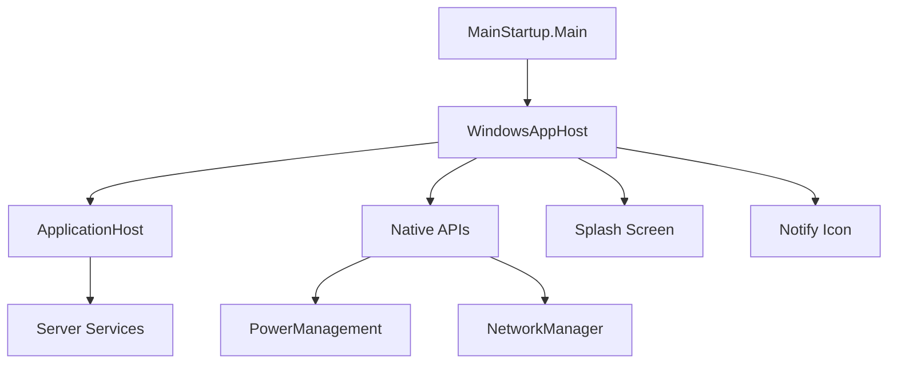
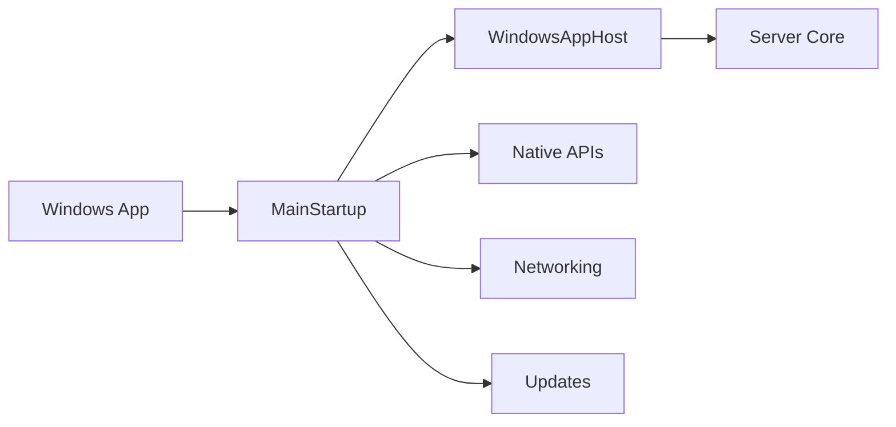

# Component: MediaBrowser.ServerApplication

**Path:** `MediaBrowser.ServerApplication/`
**Type:** Directory | Module
**Language:** C#
**Maps to:** `.discovery/253-mediabrowser-serverapplication.md`

## Description

Windows-specific server application entry point. Contains startup logic, Windows service hosting, native interop, and system integration for the Emby Server running on Windows.

## Directory Structure

```
MediaBrowser.ServerApplication/
├── Native/              # Native Windows API interop
├── Networking/          # Network management
├── SocketSharp/         # WebSocket implementation
├── Splash/              # Splash screen UI
├── Updates/             # Application update logic
├── ApplicationPathHelper.cs
├── BackgroundService.cs
├── BackgroundServiceInstaller.cs
├── ImageEncoderHelper.cs
├── MainStartup.cs
├── ServerNotifyIcon.cs
└── WindowsAppHost.cs
```

## Files

| File | Description |
|------|-------------|
| `MainStartup.cs` | Main entry point, service management |
| `WindowsAppHost.cs` | Windows application host |
| `ApplicationPathHelper.cs` | Application paths configuration |
| `BackgroundService.cs` | Background service logic |
| `BackgroundServiceInstaller.cs` | Service installer |
| `ImageEncoderHelper.cs` | Image encoder setup |
| `ServerNotifyIcon.cs` | System tray icon |
| `Properties/Resources.Designer.cs` | Embedded resources |
| **Native/** | |
| `Native/LoopUtil.cs` | Loopback utility |
| `Native/ServerAuthorization.cs` | Server authorization |
| `Native/Standby.cs` | Standby management |
| `Native/LnkShortcutHandler.cs` | Shortcut handler |
| **Networking/** | |
| `Networking/NetworkShares.cs` | Network shares |
| `Networking/NativeMethods.cs` | Native network methods |
| **SocketSharp/** | |
| `SocketSharp/WebSocketSharpListener.cs` | WebSocket listener |
| `SocketSharp/WebSocketSharpRequest.cs` | WebSocket request |
| `SocketSharp/WebSocketSharpResponse.cs` | WebSocket response |
| `SocketSharp/RequestMono.cs` | Mono request handler |
| `SocketSharp/SharpWebSocket.cs` | Sharp WebSocket |
| **Splash/** | |
| `Splash/SplashForm.cs` | Splash screen form |
| `Splash/SplashForm.Designer.cs` | Splash screen designer |
| **Updates/** | |
| `Updates/ApplicationUpdater.cs` | Application updater |

## Decomposition

### MainStartup.cs (Main Entry Point)

#### Imports
```csharp
using MediaBrowser.Model.Logging;
using MediaBrowser.Server.Startup.Common;
using MediaBrowser.ServerApplication.Native;
using MediaBrowser.ServerApplication.Splash;
using MediaBrowser.ServerApplication.Updates;
using Microsoft.Win32;
using System;
using System.Configuration.Install;
using System.Diagnostics;
using System.IO;
using System.Linq;
using System.Management;
using System.Runtime.InteropServices;
using System.ServiceProcess;
using System.Windows.Forms;
```

#### Classes
`MainStartup` (public class)

#### Key Properties
| Property | Type | Description |
|----------|------|-------------|
| `ApplicationPath` | `string` | Executable path |
| `IsRunningAsService` | `bool` | Service mode flag |

#### Key Methods
| Method | Return | Description |
|--------|--------|-------------|
| `Main()` | `void` | Application entry point |
| `CreateApplicationPaths(string, bool)` | `IServerApplicationPaths` | Create paths |
| `InstallService()` | `void` | Install Windows service |
| `UninstallService(string, ILogger)` | `void` | Remove service |

### WindowsAppHost.cs (Windows Application Host)

#### Imports
```csharp
using MediaBrowser.Controller;
using MediaBrowser.Model.Logging;
using MediaBrowser.Server.Implementations;
using System;
using System.IO;
```

#### Classes
`WindowsAppHost` (public class : ServerApplicationHost, IDisposable)

#### Key Methods
| Method | Return | Description |
|--------|--------|-------------|
| `Init()` | `Task` | Initialize host |
| `GetLogFileName()` | `string` | Log file name |

### Native/PowerManagement.cs

#### Imports
```csharp
using System;
using System.Runtime.InteropServices;
using System.Threading;
using System.Threading.Tasks;
```

#### Classes
`PowerManagement` (public static class)

#### Key Methods
| Method | Return | Description |
|--------|--------|-------------|
| `AllowSleep()` | `void` | Enable sleep |
| `PreventSleep()` | `void` | Prevent sleep |
| `ResetPerformanceCounters()` | `void` | Reset counters |

### Native/NetworkManager.cs

#### Classes
`NetworkManager` (public class)

#### Key Methods
| Method | Return | Description |
|--------|--------|-------------|
| `GetNetworkConfiguration()` | `NetworkInfo` | Get network config |
| `RefreshNetworkInfo()` | `Task` | Refresh network |

## Architecture



## Dependencies

- `MediaBrowser.Controller` — Server interfaces
- `MediaBrowser.Server.Implementations` — Server implementation
- `Emby.Drawing` — Image processing
- `System.ServiceProcess` — Windows services
- `System.Management` — WMI access

## Statistics

| Metric | Value |
|--------|-------|
| C# Files | 27 |
| Directories | 6 |
| LOC | ~3,000 |

## Mermaid Diagram


