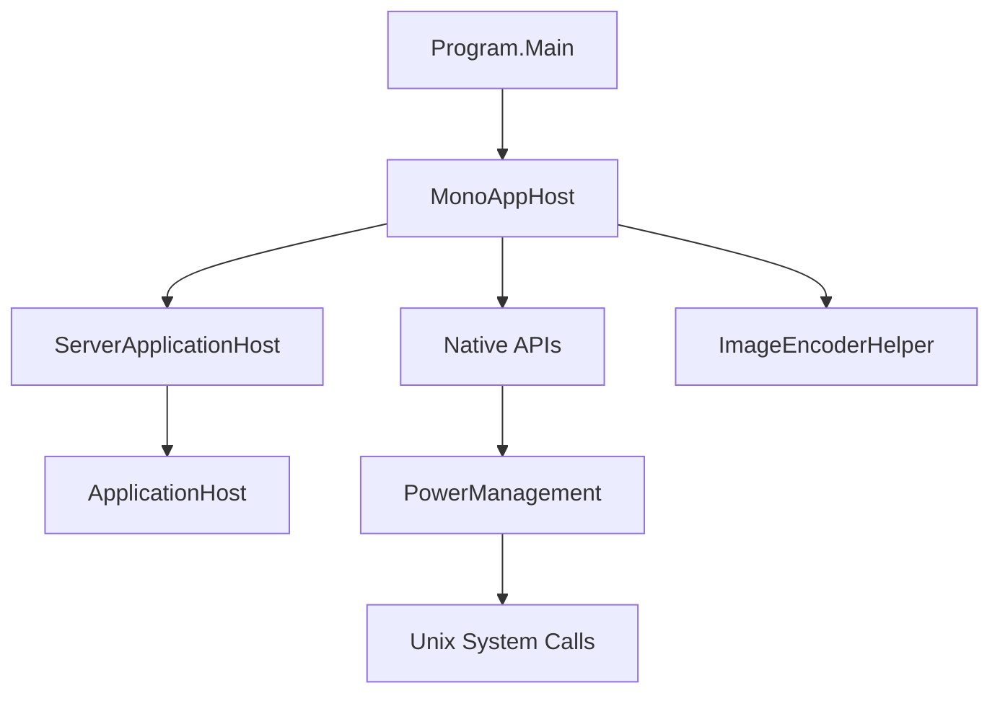
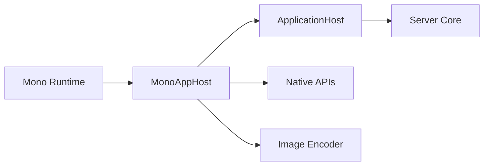

# Component: MediaBrowser.Server.Mono

**Path:** `MediaBrowser.Server.Mono/`
**Type:** Directory | Module
**Language:** C#
**Maps to:** `.discovery/254-mediabrowser-server-mono.md`

## Description

Linux/macOS specific server application host using Mono runtime. Contains platform-specific initialization, native interop for Unix systems, and alternative implementations for non-Windows platforms.

## Directory Structure

```
MediaBrowser.Server.Mono/
├── Native/                   # Unix-specific native APIs
├── Properties/              # Assembly metadata
├── ApplicationPathHelper.cs  # Path configuration
├── ImageEncoderHelper.cs    # Image encoder setup
├── MonoAppHost.cs          # Mono application host
├── Program.cs              # Entry point
├── packages.config         # NuGet packages
└── *.config               # Native library configs
```

## Files

| File | Description |
|------|-------------|
| `Program.cs` | Application entry point |
| `MonoAppHost.cs` | Mono-specific application host |
| `ApplicationPathHelper.cs` | Platform paths |
| `ImageEncoderHelper.cs` | Image encoder setup |
| `Native/PowerManagement.cs` | Unix power management |

## Decomposition

### Program.cs (Entry Point)

#### Imports
```csharp
using MediaBrowser.Model.Logging;
using MediaBrowser.Server.Implementations;
using System;
using System.IO;
using System.Threading;
using System.Threading.Tasks;
```

#### Classes
`Program` (internal static class)

#### Key Methods
| Method | Return | Description |
|--------|--------|-------------|
| `Main()` | `int` | Application entry point |
| `RunApplication()` | `Task<int>` | Run server app |

### MonoAppHost.cs (Mono Application Host)

#### Imports
```csharp
using MediaBrowser.Controller;
using MediaBrowser.Model.Logging;
using MediaBrowser.Server.Implementations;
using System;
using System.IO;
```

#### Classes
`MonoAppHost` (public class : ServerApplicationHost, IDisposable)

#### Key Properties
| Property | Type | Description |
|----------|------|-------------|
| `FileSystem` | `IFileSystem` | File system abstraction |
| `PowerManagement` | `IPowerManagement` | Power control |

#### Key Methods
| Method | Return | Description |
|--------|--------|-------------|
| `Init()` | `Task` | Initialize host |
| `GetLogFileName()` | `string` | Get log file name |
| `SetPreferredLanguage(string)` | `void` | Set language |

### Native/PowerManagement.cs (Unix Power Management)

#### Imports
```csharp
using System;
using System.Runtime.InteropServices;
using System.Threading.Tasks;
```

#### Classes
`PowerManagement` (public static class)

#### Key Methods
| Method | Return | Description |
|--------|--------|-------------|
| `AllowSleep()` | `void` | Enable sleep states |
| `PreventSleep()` | `void` | Prevent sleep |
| `SetSuspendState(bool)` | `void` | Suspend system |

## Architecture



## Dependencies

- `MediaBrowser.Controller` — Server interfaces
- `MediaBrowser.Server.Implementations` — Core server
- `Emby.Drawing` — Image processing
- `Mono.Posix` — Unix system calls

## Statistics

| Metric | Value |
|--------|-------|
| C# Files | 11 |
| Directories | 2 |
| LOC | ~1,500 |

## Mermaid Diagram


